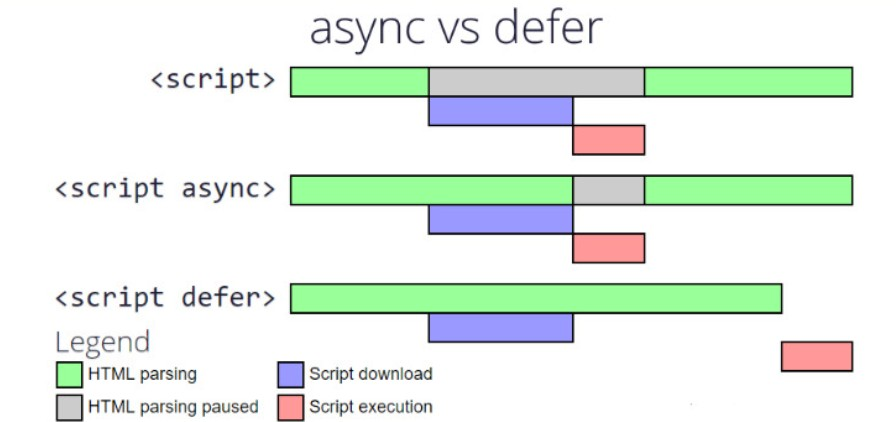

# Async Vs Defer in JS 

<script src="..."> — Normal Script

-> When HTML parser sees <script>, it stops right there.

-> It waits until the script is downloaded and executed.

-> After that, the parser continues parsing the rest of the HTML.

<script async src="..."> — Async Script

-> When HTML parser sees <script async>, it keeps parsing the HTML.

-> Meanwhile, the script is downloading in the background.

-> As soon as it's ready, parser pauses, script runs, then parsing resumes.

(⚠️ Execution order is not guaranteed if multiple scripts have async.)

<script defer src="..."> — Defer Script

-> When HTML parser sees <script defer>, it keeps parsing the whole HTML.

-> Scripts are downloaded in the background, but not executed immediately.

-> After full parsing is done, scripts are executed in order.