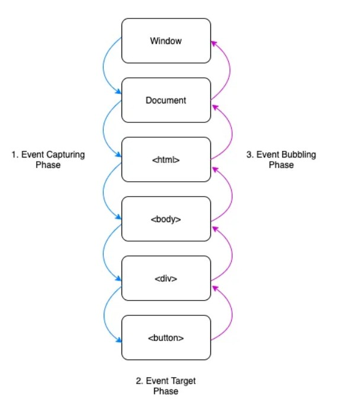

# JavaScript Events 

# What is an Event?

-> An event is a signal that indicates something has occurred.

-> User actions like clicks, key presses, mouse movements, and form submissions are common examples of events.

-> The browser fires these events, and we handle them using addEventListener.

# What is Event Propagation?

When an event occurs on a nested element, it moves through the DOM in three phases:

-> Capturing Phase – Event travels from the root to the target element (outer → inner)

-> Target Phase – Event reaches the target element

-> Bubbling Phase – Event bubbles back from target to root (inner → outer)


# Capturing Phase

-> Capturing (also called "trickling") is the phase when the event travels from the top/root of the DOM down to the target element.

-> Flow Direction when Button is clicked: document → html → body → #outer → #inner → #btn

-> During this downward flow, any listeners registered with { capture: true } are triggered.

✅ HTML

<div id="outer" style="padding: 20px; background-color: lightblue;">
  Outer
  <div id="inner" style="padding: 20px; background-color: lightgreen;">
    Inner
    <button id="btn" style="padding: 10px;">Click Me</button>
  </div>
</div>

✅ JavaScript

```js

document.getElementById('outer').addEventListener('click', () => {
  console.log('Outer - Capturing Phase');
}, true); // capture = true

document.getElementById('inner').addEventListener('click', () => {
  console.log('Inner - Capturing Phase');
}, true);

document.getElementById('btn').addEventListener('click', () => {
  console.log('Button - Capturing Phase');
}, true);

```

✅ Output when clicking the button:

Outer - Capturing Phase
Inner - Capturing Phase
Button - Capturing Phase


🔁 Event Flow (Downward):

document
   ↓
 html
   ↓
 body
   ↓
#outer  → [Capturing listener fires]
   ↓
#inner  → [Capturing listener fires]
   ↓
#btn    → [Capturing listener fires]


# Target Phase

This is the moment when the event reaches the exact element that the user clicked, hovered over, or interacted with.

Only the target element is involved in this phase.

Both capture and bubble listeners attached to the target element will fire here (if any).

✅ HTML

<div id="outer" style="padding: 20px; background-color: lightblue;">
  Outer
  <div id="inner" style="padding: 20px; background-color: lightgreen;">
    Inner
    <button id="btn" style="padding: 10px;">Click Me</button>
  </div>
</div>

✅ JavaScript

```js

// OUTER
document.getElementById('outer').addEventListener('click', () => {
  console.log('Outer - Capturing Phase');
}, true);

document.getElementById('outer').addEventListener('click', () => {
  console.log('Outer - Bubbling Phase');
});

// INNER
document.getElementById('inner').addEventListener('click', () => {
  console.log('Inner - Capturing Phase');
}, true);

document.getElementById('inner').addEventListener('click', () => {
  console.log('Inner - Bubbling Phase');
});

// BUTTON
document.getElementById('btn').addEventListener('click', () => {
  console.log('Button - Capturing Phase');
}, true);

document.getElementById('btn').addEventListener('click', () => {
  console.log('Button - Bubbling Phase');
});


```
✅ What Happens When You Click the Button:

You’ll see this in the console (in this exact order):

Outer - Capturing Phase
Inner - Capthasuring Pe
Button - Capturing Phase
Button - Bubbling Phase
Inner - Bubbling Phase
Outer - Bubbling Phase

Why This Order?

-> Capturing: from outer → inner → button

-> Target phase: happens at button (both listeners run here)

-> Bubbling: from button → inner → outer


🔁 Visualization:

        ↓ (capturing)
... → #btn → (event occurs here)
        ↑ (bubbling)

Imagine dropping a ball from the top of a tree:

    -> Capturing phase = ball falling down the branches

    -> Target phase = ball hits a leaf (your clicked element)

    -> Bubbling phase = ball bounces back up


# Bubbling Phase

-> Bubbling is the last phase of the event flow.

-> It happens after the event reaches the target element.

-> The event bubbles up from the target element to the top of the DOM tree.

-> Flow Direction when Button is Clicked: #btn → #inner → #outer → body → html → document

-> This is an upward flow.

-> Any element with an event listener (default is bubbling) will get triggered in this phase.

-> You don’t need to pass { capture: false } — bubbling is the default behavior.

✅ HTML

<div id="outer" style="padding: 20px; background-color: lightblue;">
  Outer
  <div id="inner" style="padding: 20px; background-color: lightgreen;">
    Inner
    <button id="btn" style="padding: 10px;">Click Me</button>
  </div>
</div>

✅ JavaScript

```js

document.getElementById('btn').addEventListener('click', () => {
  console.log('Button - Bubbling Phase');
}); // bubbling by default

document.getElementById('inner').addEventListener('click', () => {
  console.log('Inner - Bubbling Phase');
});

document.getElementById('outer').addEventListener('click', () => {
  console.log('Outer - Bubbling Phase');
});

```

✅ Output When You Click the Button:

Button - Bubbling Phase
Inner - Bubbling Phase
Outer - Bubbling Phase

🔁 Event Flow (Upward):

document
   ↑
 html
   ↑
 body
   ↑
#outer  → [Bubbling listener fires]
   ↑
#inner  → [Bubbling listener fires]
   ↑
#btn    → [Bubbling listener fires]





# How to Stop Event Bubbling in JavaScript?

Sometimes, we want to prevent the event from bubbling up or even stop other listeners on the same element.

JavaScript provides two methods for that:

    -> event.stopPropagation()

    -> event.stopImmediatePropagation()


# event.stopPropagation()

event.stopPropagation() 

-> stops the event from bubbling up to parent elements.

-> Allows other listeners on the same element to still run.


🧪 Example: Two Button Listeners


<div id="outer" style="padding: 20px; background-color: lightblue;">
  Outer
  <button id="btn" style="margin-top: 10px;">Click Me</button>
</div>

```js

// Button - Listener 1
document.getElementById('btn').addEventListener('click', (e) => {
  console.log('Button Listener 1');
  e.stopPropagation(); // Stops bubbling
});

// Button - Listener 2
document.getElementById('btn').addEventListener('click', () => {
  console.log('Button Listener 2');
});

// Outer Div Listener
document.getElementById('outer').addEventListener('click', () => {
  console.log('Outer Clicked');
});

```

✅ Output:

Button Listener 1
Button Listener 2

Explanation

-> ✅ Bubbling is stopped — so Outer Clicked is not printed.

-> ❗️Both listeners on the same button still run.


# event.stopImmediatePropagation()

event.stopImmediatePropagation()

-> Stops bubbling to parent elements.

-> Also stops other listeners on the same element.

🧪 Example: Two Button Listeners

```js

// Button - Listener 1
document.getElementById('btn').addEventListener('click', (e) => {
  console.log('Button Listener 1');
  e.stopImmediatePropagation(); // Stops everything
});

// Button - Listener 2
document.getElementById('btn').addEventListener('click', () => {
  console.log('Button Listener 2');
});

// Outer Div Listener
document.getElementById('outer').addEventListener('click', () => {
  console.log('Outer Clicked');
});


```

✅ Output: Button Listener 1

Explanation:

❌ Listener 2 on the same button is stopped.
❌ Bubbling to #outer is also stopped.


✅ event.stopPropagation() -

Stops the event from bubbling up to parent elements — but allows other event listeners on the same element to run.

✅ event.stopImmediatePropagation() -
 
Stops the event from bubbling up and prevents any remaining listeners on the same element from running.


# What is Event Delegation?

Event delegation is a technique in JavaScript where instead of attaching event listeners to multiple child elements, you attach one event listener to their common parent (ancestor), and use that to handle events for the children.


# Before Event Delegation


❌ Old/Naive Way — Add Listeners to Every Child

```js

const allItems = document.querySelectorAll('li');

allItems.forEach(item => {
  item.addEventListener('click', () => {
    console.log(item.textContent);
  });
});

```

📘 Explanation:

-> This code adds a separate click listener to every single <li>.

-> Works fine only for existing elements.


**Problem 1: Multiple Listeners = Bad Performance**

```js

for (let i = 0; i < 1000; i++) {

  // Create a <li> element with text content

  const li = document.createElement('li');

  li.textContent = `Item ${i + 1}`;

  document.querySelector('ul').appendChild(li);

  // ❌ Attaching an individual event listener to each <li> (not efficient)

  li.addEventListener('click', () => {
    console.log(li.textContent);
  });
}


```

📘 Explanation:

-> If you have 1000 <li> elements, this means 1000 event listeners in memory.

-> Increases memory usage and slows down performance. 💥


**Problem 2: Dynamic Elements Don't Work Automatically**

```js

const newItem = document.createElement('li');
newItem.textContent = '🥭 Mango';
document.querySelector('ul').appendChild(newItem);

```

// ❌ No event listener attached to this new <li>

📘 Explanation:

-> If you add a new <li> after initial load, it won't respond to clicks.

-> You'd have to manually attach a new listener again — not scalable.


# After Event Delegation

✅ Solution 1: One Listener for All Children

**HTML**

<ul>
  <li>🍎 Apple</li>
  <li>🍌 Banana</li>
  <li>🍇 Grapes</li>
  <li>🍊 Orange</li>
</ul>

```js

const ul = document.querySelector('ul');

ul.addEventListener('click', (e) => {         // Attach a single listener to the parent <ul>

  if (e.target.tagName === 'LI') {            // Check if the clicked target is a <li> , e.target.tagName returns LI
    console.log(e.target.textContent);
  }
});

```

📘 Explanation:

-> Instead of 1000 listeners on each <li>, we now have just one listener on the <ul>.

-> The listener uses event.target to check what was clicked.

-> Saves memory, boosts performance, and keeps code cleaner.


✅ Solution 2: Works for Dynamically Added Elements

```js

const newItem = document.createElement('li');

newItem.textContent = '🥭 Mango';

document.querySelector('ul').appendChild(newItem);

// No need to add any extra listener to <li>

// It'll be handled by the <ul>'s event listener

```

📘 Explanation:

-> Newly added <li> elements work out of the box.

-> The listener on <ul> still catches the click event via event bubbling.

-> No need to reattach listeners = automatic scalability.


# event.target vs event.currentTarget

e.target → The actual element that was clicked by the user.

e.currentTarget → The element that the event listener is attached to.

**Code Example**

<ul id="fruits">
  <li>🍎 Apple</li>
  <li>🍌 Banana</li>
  <li>🍇 Grapes</li>
</ul>

```js

const ul = document.getElementById('fruits');

ul.addEventListener('click', (e) => {
  console.log('👉 e.target:', e.target.tagName, '-', e.target.textContent);
  console.log('👂 e.currentTarget:', e.currentTarget.tagName);
});

```

Explanation

-> Event Listener is on <ul>, not on the <li> elements.

-> When you click on <li>🍇 Grapes</li>:

-> e.target → 'LI' — because that’s the element actually clicked.

-> e.target.textContent → '🍇 Grapes'

-> e.currentTarget → 'UL' — because the listener is on the <ul>.


**Sample Output (if you click on Banana)**


👉 e.target: LI - 🍌 Banana
👂 e.currentTarget: UL


# Non-Bubbling Events

-> Some DOM events do not bubble up the DOM tree. That means they are only handled on the element they occur on, not passed to parent elements.


-> Examples of non-bubbling events include: focus, blur, load, unload, mouseenter, and mouseleave.


❌ focus Does NOT Bubble

HTML:

<div id="parent">
  <input type="text" id="child" placeholder="Click me" />
</div>

JavaScript:

```js

const parent = document.getElementById('parent');
const child = document.getElementById('child');

parent.addEventListener('focus', () => {
  console.log('Parent detected focus!');
});

child.addEventListener('focus', () => {
  console.log('Child focused');
});

```
Output: Child focused

focus event only triggers on the child — it does not bubble to the parent.


# preventDefault() 


preventDefault() stops the default browser behavior for an event from happening.


🧪 Example 1: Preventing Form Submission

```js

const form = document.querySelector('form');

form.addEventListener('submit', (e) => {
  e.preventDefault(); // Stops form from reloading the page
  console.log('Form submitted (but not reloaded)');
});

```
Explanation:

-> Normally, submitting a form reloads the page.

-> preventDefault() stops that default action.


🧪 Example 2: Preventing Link Navigation

```js

const link = document.querySelector('a');

link.addEventListener('click', (e) => {
  e.preventDefault(); // Stops the link from navigating
  console.log('Link clicked (but did not navigate)');
});

```

# Passive Event Listener

Why preventDefault() Affects Performance in Scroll/Touch Events ?

When you listen to scroll/touch events like this:


✅ With passive: false:

```js

window.addEventListener('touchmove', (e) => {
  e.preventDefault(); // This blocks scrolling! scrolling wont even work here
}, { passive: false });

```


✅ With passive: true:

```js

window.addEventListener('touchmove', handler, { passive: true });

```

->  You promise the browser that preventDefault() won’t be called

->  The browser scrolls immediately → Smooth UX

->  Browser won’t wait for preventDefault() — boosts performance.


# preventDefault Vs Passive Listener


->  preventDefault()	Stops default behavior (like form submit, scroll, link nav)

->  Passive Listener	Tells browser no preventDefault() will be used — boosts scroll performance


# What happens if you use e.preventDefault() inside a passive listener?


```js

window.addEventListener('touchmove', (e) => {
  e.preventDefault(); // ❌ This will throw a warning or error!
}, { passive: true });

```


Why this is a problem ?

-> When you use { passive: true }, you're promising the browser "Hey browser, I will not call e.preventDefault() in this event handler."

-> This lets the browser immediately start scrolling without waiting to check if you'll block it — hence, better performance.

-> But if you break that promise and do call e.preventDefault(), the browser gets confused 😠 and will Show a console warning like: "Unable to preventDefault inside passive event listener."

Scrolling will still happen, but you'll get a console warning because e.preventDefault() is ignored inside a passive listener.


Correct Usage:
If you need to call e.preventDefault(), then you must disable passive mode:

```js

window.addEventListener('touchmove', (e) => {
  e.preventDefault(); // ✅ Allowed
}, { passive: false });

```

# once Option in addEventListener

The once option allows an event listener to run only once, and then it is automatically removed.

🧪 Example: Click Only Once

<button id="myBtn">Click Me</button>

```js

const element = document.getElementById("myBtn");

element.addEventListener("click", () => {
  console.log("Clicked once!");
}, { once: true });

```

Explanation:

-> The click event will trigger only the first time the button is clicked.

-> After that, the event listener is automatically removed.

-> You don’t need to manually call removeEventListener().


What happens if I click the button a second time after using { once: true }?

No, the event handler will NOT be invoked the second time.


✅ Use Cases:

-> Showing a one-time tooltip or message.

-> Initializing something only once on user interaction.

-> Tracking first-time interactions for analytics.


# signal Option in addEventListener()

The signal option lets you attach an AbortController to an event listener — so you can remove the listener programmatically at any time by calling .abort().


```js

const controller = new AbortController(); // 1️⃣ Create a controller

const btn = document.getElementById('myBtn');

btn.addEventListener('click', () => {
  console.log('Button clicked!');
}, { signal: controller.signal }); // 2️⃣ Pass the signal

// Later, you can remove the listener like this:

controller.abort(); // 3️⃣ Removes the event listener

```

Explanation:

-> controller.signal connects the event listener to the controller.

-> controller.abort() removes the listener — like calling removeEventListener, but in a cleaner and more flexible way.

-> Useful for cancelling multiple listeners together when needed.


When to Use signal:

-> In modern apps or components where cleanup is important (e.g., in React/Angular/Vue).

-> To abort multiple event listeners with a single .abort().

-> In timeouts, async operations, or scroll/touch handlers that need cleanup.


# Remove Multiple Event Listeners Using AbortController

Use a single AbortController to attach multiple listeners with the same signal. Calling .abort() removes all listeners tied to that signal — clean and efficient.

🧪 Example: Remove Click, Mouseover, and Keydown Together

<button id="btn">Click Me</button>
<input id="input" placeholder="Type here" />

```js

const controller = new AbortController(); // 1️⃣ Create one controller

const btn = document.getElementById('btn');

const input = document.getElementById('input');


// 2️⃣ Attach multiple listeners with the same signal

btn.addEventListener('click', () => {
  console.log('Button clicked!');
}, { signal: controller.signal });

btn.addEventListener('mouseover', () => {
  console.log('Button hovered!');
}, { signal: controller.signal });

input.addEventListener('keydown', () => {
  console.log('Key pressed!');
}, { signal: controller.signal });


// 3️⃣ Remove all listeners with a single call

setTimeout(() => {
  controller.abort();
  console.log('All listeners removed!');
}, 5000);

```

Explanation:

-> controller.signal is passed into all event listeners.

-> After 5 seconds, controller.abort() removes every listener attached with that signal.

-> No need to manually track and remove each listener — very useful in apps and components!


# Memory Leaks

-> Memory leaks happen when unused objects are not garbage collected because something still holds a reference to them — like an event listener.

-> In SPAs (Single Page Applications), if you add event listeners but forget to remove them when a DOM element is deleted, it stays in memory.
This causes performance issues over time.

✅ HTML

<!DOCTYPE html>
<html>
  <body>
    <div id="container">
      <button id="myBtn">Click Me</button>
    </div>
  </body>
</html>

# When is a DOM Element "Deleted"?

-> A DOM element is considered deleted (or removed) when you explicitly remove it from the DOM tree using methods like:

✅ Javascript

**element.remove()**

```js

const btn = document.getElementById('myBtn');

btn.remove(); // ✅ Deletes the element from the DOM

```
**parent.removeChild(child)**

```js

const parent = document.getElementById('container');

const child = document.getElementById('myBtn');

parent.removeChild(child); // ✅ Deletes the child element from DOM

```

**Overwriting with innerHTML**

```js

document.getElementById('container').innerHTML = '';  // ❗️ All children inside #container are deleted

```

**Using frameworks (like React/Angular/Vue)**

-> In SPAs, components are removed from the DOM when:

-> You navigate to another page/route

-> You conditionally render elements (e.g. if (show) <div>...</div>)

-> These frameworks internally use methods like removeChild().


Always clean up with:

```js

element.removeEventListener('click', fn);

```
✅ Especially in SPAs or when DOM nodes are removed.


# Accessibility & Keyboard Events

-> Some people don’t use a mouse.

-> They use a keyboard to move around and do things on a website.

-> So we should make sure users can press Enter or Spacebar to "click" things like buttons — even if we are using a div or custom element.


<div id="myBtn" role="button" tabindex="0">
  Submit
</div>

```js

const button = document.getElementById('myBtn');

// ✅ Let keyboard users trigger the "click"

button.addEventListener("keydown", (e) => {
  if (e.key === "Enter" || e.key === " ") {
    console.log("Keyboard click!");
    button.click();                           // Optional: acts like a real click
  }
});

```

What this code does ?

-> role="button": Tells screen readers "this is a button"

-> tabindex="0": Makes the element focusable with the Tab key.

-> keydown: Listens for Enter or Space key presses.

-> If pressed, it calls button.click() — just like a mouse click.


# Global Event Handling

-> Sometimes, you need to listen for events anywhere on the page — not just on one element.

-> In that case, you can attach event listeners to global objects like:

    document → for keyboard events, modals, and shortcuts

    window → for resizing, scrolling, or when the user leaves the page


```js

// Handle keyboard shortcuts or Escape key globally

document.addEventListener('keydown', (e) => {
  if (e.key === 'Escape') {
    console.log('Escape pressed — maybe close a modal!');
  }
});

// Detect when the user scrolls

window.addEventListener('scroll', () => {
  console.log('User is scrolling the page!');
});

// Detect window resizing

window.addEventListener('resize', () => {
  console.log(`Window resized to ${window.innerWidth}px wide`);
});

// Detect when the user is about to leave

window.addEventListener('beforeunload', (e) => {
  e.preventDefault();
  e.returnValue = ''; // Required for most browsers which Shows browser's built-in confirm popup
});


```
Explanation -

-> document.addEventListener('keydown') catches any key press, even if no element is focused.

-> window.addEventListener('scroll') triggers every time the user scrolls anywhere on the page.

-> window.addEventListener('resize') useful for responsive design — detect if screen size changes.

-> window.addEventListener('beforeunload') helps warn the user before they leave (useful if a form is not saved).


# Event Listener & the Event Loop


<button id="btn">Click Me</button>

<script>
  console.log('1');

  const btn = document.getElementById('btn');

  btn.addEventListener('click', () => {
    console.log('2 - Button Clicked');
  });

  console.log('3');
</script>


Question: When does "2 - Button Clicked" log? And how does it relate to the call stack, Web APIs, and event loop?


**Step 1: Script execution starts**

```js

console.log('1'); 

```
Runs immediately (call stack)

✅ Output: 1

**Step 2: Add event listener**

```js

btn.addEventListener('click', () => {
  console.log('2 - Button Clicked');
});

```

-> This registers a callback in the browser’s Web API (Event Target System).

-> It doesn’t execute anything right now — just says: "Hey browser, when the button is clicked, run this function."

-> This callback is stored with the event system, waiting to be triggered.

**Step 3: Continue script**

```js

console.log('3');

```

✅ Output: 3

Up to Now, Output is:
1
3

**Now: You CLICK the button**

This is where the event loop story starts! 🎯

What happens behind the scenes:

    -> The browser sees the click event.

    -> The callback is scheduled → placed into the macro task queue.

    -> The event loop checks: “Is the call stack empty? If yes 👉 push the event callback into the call stack and execute it.

      () => {
        console.log('2 - Button Clicked');
      }


✅ Output: 2 - Button Clicked


# Custom Events


What are Custom Events?

Custom Events let you create and dispatch your own events, just like built-in ones (click, submit, etc.).
They are super helpful when you want different parts of your app (like components) to communicate without being tightly connected.


**Why Use Custom Events?**

-> To trigger specific actions in response to something that happened inside a component

-> To send custom data along with the event

-> Great in frameworks like React, Web Components, or vanilla JS apps


**Listening for a Custom Event**

```js

element.addEventListener("eventName", function(e) {
  console.log("Event received!");
  console.log("Data:", e.detail);  // access custom data here
});

```


**Createing a custom event syntax**

const event = new CustomEvent(eventName, options);

```js

const event = new CustomEvent("eventName", {
  detail: { anyData: "you want" },    // optional custom data
  bubbles: true,                      // event bubbles up the DOM (like click)
  composed: true                      // escapes shadow DOM (optional)
});

```

**Firing (Dispatching) a Custom Event – Syntax**

element.dispatchEvent(event);


**Real-life Example**


<button id="myBtn">Click me</button>

```js

// Step 1: Get element

const btn = document.getElementById('myBtn');

// Step 2: Add event listener

btn.addEventListener('customEvent', (e) => {
  console.log('Custom event received:', e.detail);
});

// Step 3: Create the event

const myEvent = new CustomEvent('customEvent', {
  detail: { name: 'Likan' },
  bubbles: true,
  composed: true
});

//  step 4: Dispatch the event 

btn.dispatchEvent(myEvent);

```

# Understanding the Correct Order of Custom Events in JavaScript


To successfully use custom events, the order in which you listen, create, and dispatch matters. Let's go through each possible order with explanations so you fully understand what works and what doesn't.


**✅ Case 1: Listen ➝ Create ➝ Dispatch (Best Practice)**

```js

element.addEventListener("myEvent", fn);        // Step 1
const event = new CustomEvent("myEvent");       // Step 2
element.dispatchEvent(event);                   // Step 3

```

Explanation:

-> This is the safest and most common pattern. You first tell the system what to do when the event fires (via addEventListener), then create the event, and finally dispatch it. Works perfectly.


**❌ Case 2: Listen ➝ Dispatch ➝ Create**

```js

element.addEventListener("myEvent", fn);        // Step 1
element.dispatchEvent(event);                   // Step 2 ❌ Event not defined yet
const event = new CustomEvent("myEvent");       // Step 3

```

Explanation:

-> This fails because you're trying to dispatch (event) before it's even created. You’ll get a ReferenceError.


**❌ Case 3: Create ➝ Dispatch ➝ Listen**

```js

const event = new CustomEvent("myEvent");       // Step 1
element.dispatchEvent(event);                   // Step 2
element.addEventListener("myEvent", fn);        // Step 3

```

Explanation:
Even though the event is created and dispatched, there's no listener at the time of dispatch. So nothing will happen. Listeners must exist before dispatching.


✅ Case 4: Create ➝ Listen ➝ Dispatch

```js

const event = new CustomEvent("myEvent");       // Step 1
element.addEventListener("myEvent", fn);        // Step 2
element.dispatchEvent(event);                   // Step 3

```

Explanation:
This works just fine too. The event is ready in memory, then a listener is added, and finally the event is dispatched. The key point is: listener exists before dispatch, so it catches the event.


# Use Case of Custom Events

You’re building a custom modal, and you want to notify the parent component when it’s closed:


🧱 HTML Structure

<!-- Parent Component -->
<div id="parent">

  <!-- Modal Component -->
  <div id="modal">
    <p>This is a modal</p>
    <button id="closeBtn">Close Modal</button>
  </div>

</div>


// Inside modal component

```js

const modal = document.getElementById("modal");
const closeBtn = document.getElementById("closeBtn");

// 1️⃣ Parent sets up a listener for the custom "modalClosed" event

modal.addEventListener("modalClosed", (e) => {
  console.log("Modal was closed because:", e.detail.reason);
  modal.style.display = "none"; // Hide the modal when the event is received
});

// 2️⃣ Inside the modal: when the close button is clicked

closeBtn.addEventListener("click", () => {

  // Create a custom event with extra data in 'detail'

  const modalClosed = new CustomEvent("modalClosed", {
    detail: { reason: "user clicked close" },           // Reason for closing
    bubbles: true,                                      // Allow event to bubble up the DOM
    composed: true                                      // Allow event to cross Shadow DOM boundary (if any)
  });

  // Fire the custom event from the modal element

  modal.dispatchEvent(modalClosed);
});


```

✅ Code Flow – Step-by-Step (Custom Event: modalClosed)

-> The modal element is selected from the DOM using getElementById.

-> The closeBtn element (inside modal) is selected using getElementById.

-> A listener is added on the modal element for a custom event called "modalClosed".

-> When the user clicks the close button, the click event triggers.

-> Inside the click handler, a custom event modalClosed is created using the CustomEvent constructor.

-> The event includes a detail object with a reason for closing the modal.

-> The custom event is dispatched (fired) using modal.dispatchEvent(modalClosed).

-> The previously registered listener on the modal element catches the event.

-> Inside that listener, e.detail.reason is logged to the console.

-> The modal is then hidden using modal.style.display = "none".


# Shadow DOM & Events


-> The Shadow DOM is a way to encapsulate HTML, CSS, and JS in a component so it doesn’t affect the rest of the page.

-> But by default, events inside the Shadow DOM do NOT escape to the outer (light) DOM.

```js

const myEvent = new CustomEvent('x', {
  bubbles: true,       // Event can bubble up
  composed: true       // ✅ Important: allow it to escape Shadow DOM
});


```
**Why composed: true Matters ?**

-> If composed: false (default), the event stays trapped inside the shadow DOM.

-> If composed: true, it can cross the boundary and be caught by the light DOM.


**Use Case**

-> Let’s say you have a custom component with Shadow DOM and it dispatches a custom event (like formSubmitted).

-> If composed: true is used, the parent page can listen to that event and respond accordingly.


**Visualize**

[Light DOM]
   ↑
  Event Listener

   ⬆  composed: true
[Shadow DOM]
   Button → dispatchEvent('x')

Without composed: true, the arrow stops at Shadow DOM — the outside world never hears it.


Example - 

✅ HTML

<div id="container"></div>


✅ JavaScript

```js

// 1️⃣ Create a custom element

class MyButton extends HTMLElement {
  constructor() {
    super();

    // 2️⃣ Attach shadow DOM

    const shadow = this.attachShadow({ mode: "open" });

    // 3️⃣ Create a button inside shadow DOM

    const button = document.createElement("button");
    button.textContent = "Click Me";

    // 4️⃣ When button is clicked, dispatch a custom event

    button.addEventListener("click", () => {
      const customEvent = new CustomEvent("custom-click", {
        detail: { message: "Button inside Shadow DOM clicked!" },
        bubbles: true,
        composed: true // 🔥 This allows it to bubble outside the shadow DOM
      });

      // Dispatch from the shadow DOM
      button.dispatchEvent(customEvent);
    });

    shadow.appendChild(button);
  }
}

// 5️⃣ Define the custom element

customElements.define("my-button", MyButton);

// 6️⃣ Add it to the DOM

document.getElementById("container").innerHTML = "<my-button></my-button>";

// 7️⃣ Add a listener in the Light DOM

document.addEventListener("custom-click", (e) => {
  alert("Received event from shadow DOM: " + e.detail.message);
});

```

Explanation

-> A custom web component is created.

-> A Shadow DOM is attached to isolate internal DOM.

-> A button is added inside the Shadow DOM.

-> On button click, a CustomEvent is dispatched.

-> Because composed: true, it crosses the Shadow DOM.

-> Light DOM listener catches the event and displays an alert.