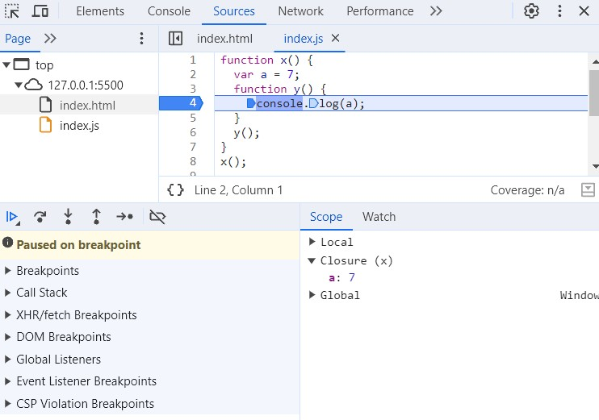

# Episode 10 : Closures  in JS

* A function bundled together with its lexical scope is called a **closure.** 



In the image above, function y, along with its lexical scope (the environment of function x), forms a closure.


when we are inside line number 3 we are inside local scope of function x . we have access to x's local variables and global variables.


When we reach line number 7, we are inside the local scope of function y. This means we have access to y's local variables. Additionally, y forms a closure with function x, allowing it to access variables from x's scope as well as the global object.


When we reach line number 16, we are inside the local scope of function z. This means we have access to z's local variables. Additionally, z forms a closure with both function y and function x, allowing it to access variables from y's scope, x's scope, and the global object.

* JavaScript follows a lexical scope environment. When a function needs to access a variable, it first checks its own local scope. If the variable is not found, it looks up in its lexical parent's scope, continuing this process until it reaches the global scope.

    ```js
   function x() {
      var a = 7;
      function y() {
        console.log(a);
      }
      return y; // Returns function y along with its lexical scope (closure)
    }

    var z = x();
    console.log(z); // The value of z is the entire function y, meaning z holds: function y() { console.log(a); }

    z();

  // Prints 7 on the console. But where does 'a = 7' come from?
  // At this point, 'a' is no longer in the local scope of y, and it’s not in the global scope either.
  // The value of 'a' comes from the closure.
  // (A closure is a temporary memory space that stores variables from a function’s parent scope.
  // These values remain accessible as long as they are used, and later get garbage collected when unused.)

    ```

    * In the code above, the outer function x returns the inner function y, and after that, x is removed from the call stack. However, behind the scenes, not just the function y is returned, but its entire closure (function y + its lexical scope) is preserved and stored in z. This means that even when z is used elsewhere in the program, it still remembers the variable a from inside x().
    
    ```


```js

  function x() {
    var a = 7; // 'a' is initially declared and assigned the value 7.
    function y() {
        console.log(a); // 'y' will access 'a' from its lexical scope.
    }
    var a = 100; // The value of 'a' is updated to 100 before returning 'y'.
    return y; // Returns function 'y' along with its lexical scope.
   }

  var z = x(); 
  // 'x()' returns function 'y' along with its lexical scope.
  // However, closures don’t store values; they store references to variables.
  // The reference to 'a' is returned, not its initial value.

  z(); 
  // When 'z()' (which is 'y()') is called, it looks for 'a' in its lexical scope.
  // By the time 'y()' executes, 'a' has been updated to 100.
  // Hence, it prints 100.

```

* Another Example

```js
   function z() {
    var b = 900; // 'b' is declared inside function 'z'
    
    function x() {
        var a = 7; // 'a' is declared inside function 'x'
        
        function y() {
            console.log(a, b); 
            // 'y' has access to:
            // - 'a' from its lexical scope (inside 'x')
            // - 'b' from its lexical scope (inside 'z')
        }
        
        y(); // Calls 'y', which prints 'a' (7) and 'b' (900)
    }
    
    x(); // Calls 'x', which in turn calls 'y'
}

z(); // Calls 'z', which executes 'x', which executes 'y' -> Output: 7 900

```

* In simple terms, a closure is a function that retains access to its outer function’s scope even after the outer function has finished executing. This means a closure can remember and access the variables and arguments of its outer function by reference, even after the function has returned.

* 

**Advantages of Closures**

Module Design Pattern – Helps in creating private variables & functions.

Currying – Enables partial function application.

Memoization – Stores computed values to optimize performance.

Data Hiding & Encapsulation – Prevents direct modification of variables.

Asynchronous Operations – Used in setTimeout, event listeners, etc.

**Disadvantages of Closures**

Increased Memory Consumption – Variables persist in memory longer than necessary.

Potential Memory Leaks – Unused closures may not be garbage collected.

Performance Issues – Excessive closures can slow down the browser.

<a href="https://www.youtube.com/watch?v=qikxEIxsXco&ab_channel=AkshaySaini" target="_blank">
</a>