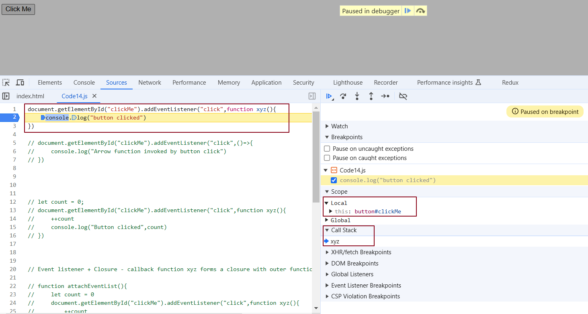

# Episode 14: Callback Functions in JS featuring Event Listeners

# Callback Functions

* Functions in JavaScript are first-class citizens, meaning they can be treated like any other variable. You can take a function A and pass it as an argument to another function B. In this case, A is called a callback function. Essentially, you are giving function B the ability to call function A whenever it needs to.

* Callback functions enable us to interact with the asynchronous world while working in a synchronous environment.

```js

setTimeout(function () {
    console.log("Timer"); // This message will be logged after the specified delay.
}, 1000); // The first argument is the callback function, and the second argument is the delay time in milliseconds (1000ms = 1 second).


```

* JavaScript is a synchronous, single-threaded language, meaning it executes code line by line, one task at a time. However, JavaScript can perform asynchronous operations using mechanisms like callbacks, promises, and async/await.


* ```js

  // Using setTimeout to schedule a callback function after 30000 ms (30 seconds).

   setTimeout(function () {
    console.log("timer"); // This will print "timer" after 30 seconds.
  }, 30000);

  // Defining a function 'x' that takes another function 'y' as an argument.

  function x(y) {
    console.log("x"); 
    y(); 
  }

  // Calling function x and passing an anonymous function y as an argument.
   x(function y() {
    console.log("y"); 
  });  // Prints "x" immediately and Calls the function y which prints "y" immediately.

  // The output will be:
  // x
  // y
  // (after 30 seconds) timer

  ```


**Call Stack 30 seconds ago:**


  * At first, the call stack has x and y in it. Once the code finishes running, both are removed, leaving the stack empty. Then, after 30 seconds, the setTimeout callback (an anonymous function) suddenly appears at the top of the stack.

**Call Stack 30 seconds later:**


  * In summary, all three functions are executed through the call stack. If any operation blocks the call stack, it is called **blocking the main thread.**. If x() takes 30 seconds to run, JavaScript has to wait for it to finish because it only has one call stack and one main thread. So, never block the main thread.

  * Always use **async** for functions that take time to finish. For example, **setTimeout** uses async under the hood.

* ```js

  // Prints a string after a random short delay, then calls the callback function

  function printStr(str, cb) {
    setTimeout(() => {
        console.log(str); // Print the string
        cb(); // Call the next function when done
    }, Math.floor(Math.random() * 100) + 1); // Random delay between 1 & 100 ms
  }

  
  function printAll() {
    printStr("A", () => { // Print "A" first
        printStr("B", () => { // After "A", print "B"
            printStr("C", () => {}); // After "B", print "C"
        });
    });
  }

  printAll(); // Output: A B C (in order)

  ```

# Code Explanation - 

**Step 1:** Call printAll()
The execution starts when the printAll() function is called.
printAll(); // Starts the process


**Step 2:** Execute printAll() Function.
Inside the printAll() function, the first function call is 

```js

printStr("A", () => {
    printStr("B", () => {
        printStr("C", () => {});
    });
});

```

What Happens Here:

-> The printStr("A", ...) function is called.
-> This goes into the call stack.
-> Inside printStr, a setTimeout is set up with a random delay (between 1 and 100 milliseconds).
-> The setTimeout itself is an asynchronous operation, so it is pushed to the Web API environment (outside the call stack).
-> The printStr("A", ...) call is removed from the call stack, leaving it empty.

**Step 3:** Wait for setTimeout to Complete.
The setTimeout delay (say 50 milliseconds) runs in the background (Web API).
During this time, the call stack remains empty, and JavaScript can perform other tasks.
After the delay, the callback function inside setTimeout moves to the Callback Queue.
The Event Loop checks the call stack and, since it's empty, moves the callback from the queue to the call stack.

**Step 4:** 

The callback of setTimeout finally gets executed inside the callstack.

console.log("A"); // Prints "A" to the console
cb(); // cb is called where cb is 

```js

() => {
    printStr("B", () => {
        printStr("C", () => {});
    });
}

```

What Happens Here:
-> "A" is printed to the console.
-> The callback (cb()) is immediately called after printing.
-> Now, cb() triggers the next printStr call which is 

```js

printStr("B", () => {
        printStr("C", () => {});
    });

```

**Step 5:** 

-> when printStr("B", ...) is called it sets up another setTimeout.
-> setTimeout moves to the Web API, and the call stack becomes empty.
-> After the random delay (say 30 milliseconds), the callback moves to the Callback Queue.
-> Event Loop moves the callback to the call stack since it's empty.
-> "B" gets printed to the console, and the next callback (cb()) is called.
-> cb is

```js

 () => {
        printStr("C", () => {});
    }

```


**Step 6:** 


when printStr("C", () => {}) is called it sets up another setTimeout.

-> setTimeout moves to the Web API, and the call stack becomes empty.
-> After the random delay (say 30 milliseconds), the callback moves to the Callback Queue.
-> Event Loop moves the callback to the call stack since it's empty.
-> "C" gets printed to the console, and the cb  ()=>{}  is called which internally returns undefined.(not printed)

**Final Step:** Call Stack Becomes Empty
After printing "C", there are no more nested callbacks to execute.
The call stack is empty, and all tasks are completed.

The final output is:
A
B
C

# Why It Works in Order (Despite Random Delays)

-> Each call to printStr is nested inside the previous callback.
-> The next function doesn’t start until the previous one finishes, even if the delay is random.
-> The **callback chain** ensures that the sequence is maintained.

**Visual Flow:**

printAll() → Calls printStr("A", ...)
printStr("A", ...) → Waits for random delay → Prints "A" → Calls printStr("B", ...)
printStr("B", ...) → Waits for random delay → Prints "B" → Calls printStr("C", ...)
printStr("C", ...) → Waits for random delay → Prints "C" 

The **key idea** is that each function call waits for the previous one to finish because the next function is inside the callback of the previous one. This is why the sequence is always maintained, regardless of the random delay.


# Understanding Event Listeners & this in JavaScript.

* To understand event listeners, let's create a button in HTML & attach an event to it.

  ```js
  
  // index.html - creating a button in HTML.
  
  <button id="clickMe">Click Me!</button>


  // index.js

  // Attach a click event listener to the button with ID "clickMe"
  document.getElementById("clickMe").addEventListener("click", function xyz() {
    // When the click event occurs, this callback function (xyz) is pushed into the call stack and executed.
    console.log("Button clicked");
  });

  ```

To understand how the call stack works, put a breakpoint inside this callback and inspect the call stack in the console.



In the image above, this refers to the button that was clicked.


# How the keyword this works in regular functions versus arrow functions ?

In JavaScript, the behavior of the this keyword differs between regular functions and arrow functions. Let's understand how it works in each case.

**Regular Function (function xyz())**

```js

document.getElementById("clickMe").addEventListener("click", function xyz() {
  console.log("Button clicked");
  console.log(this); // Points to the button that was clicked
});

```

Explanation:

-> When you use a regular function as an event listener, the value of this inside the function points to the HTML element that triggered the event (in this case, the button).

-> In other words, this refers to the button that was clicked.

-> This behavior occurs because regular functions get their 'this' value based on how they are called (through the event listener in this case).


**Arrow Function (() => {})**

```js

document.getElementById("clickMe").addEventListener("click", () => {
    console.log("Arrow function invoked by button click");
    console.log(this); // Points to the window object
});

```
Explanation:

-> When you use an arrow function as an event listener, the value of this does not point to the button.
-> Instead, it inherits this from its surrounding scope (a concept called lexical scoping).
-> In the global context, this usually points to the window object.
-> In strict mode, this becomes undefined, which is the default behavior in modern browsers.


# Closures vs Global Variable 

Question - Why global variable is not recommended for data privacy?

Answer  - Because any part of the code can change it, so the data is not protected.

```js
let count = 0;

button.addEventListener("click", () => console.log(++count));

// Somewhere else in the code

count = 100; // ❌ Someone changed the global count

// Now when the button is clicked, it logs 101 . This is not safe . This is not controlled.

```

Question - Why closure is good ?

Answer - 

```js

function createCounter() {
  let count = 0; // private
  return () => console.log(++count);
}

const increment = createCounter();
button.addEventListener("click", increment); // Event listener forms a closure with 'count'

```

Closure is good because - 

➜ count becomes private → nobody can change it
➜ Only the returned function can use it
➜ Value does not reset → closure remembers it
➜ Safe, controlled, clean


One-liner - Global variables can be changed from anywhere, but closures keep the variable private and safe, so only the function can update it.


# Garbage Collection and removeEventListeners | Why do we remove Event Listeners ?

****

➜ Event listeners create closures, so the callback keeps the variables it uses in memory. The browser keeps them alive because it doesn’t know when the event will happen again (e.g., the next button click). So the closure stays for future use.

➜ Common event listeners like onClick, onHover, and onScroll can consume significant memory due to closures.If unused listeners aren’t removed, they keep holding memory and can make the app less responsive.

➜ Remove event listeners you don’t need; it lets the browser free memory and keeps the page fast. After we remove an event listener with removeEventListener, the browser can garbage-collect it, which frees memory and makes the page faster.

<hr>

Watch Live On Youtube below:

<a href="https://www.youtube.com/watch?v=btj35dh3_U8&ab_channel=AkshaySaini" target="_blank"></a>


use cases of this - Refer lecture 30