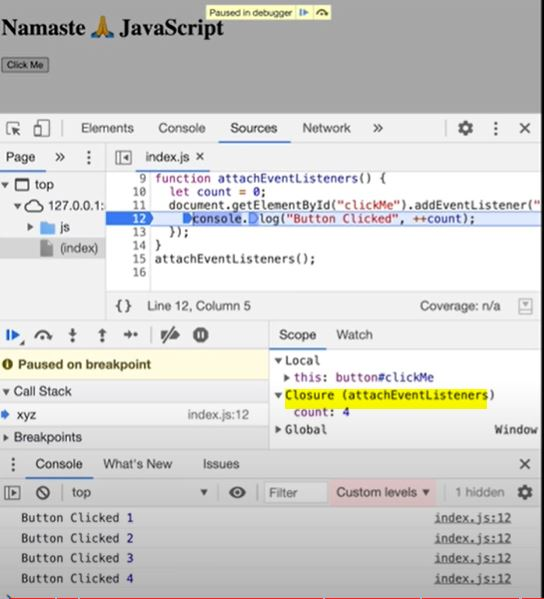

# Episode 14 : Callback Functions in JS ft. Event Listeners

### Callback Functions
* Functions are first class citizens ie. take a function A and pass it to another function B. Here, A is a callback function. So basically I am giving access to function B to call function A. This callback function gives us the access to whole **Asynchronous** world in **Synchronous** world.
```js
setTimeout(function () {
    console.log("Timer");
}, 1000) // first argument is callback function and second is timer.
```

* JS is a synchronous and single threaded language. But due to callbacks, we can do async things in JS.

* ```js

  setTimeout(function () {
    console.log("timer");
  }, 30000);

  function x(y) {
    console.log("x");
    y();
  }
  x(function y() {
    console.log("y");
  });
  // x y timer
  ```
Call stack before 30 sec -


  * In the call stack, first x and y are present. After code execution, they go away and stack is empty. Then after 30 seconds anonymous suddenly appear up in the stack ie. setTimeout

callstack after 30 sec -


  * In summaray all these 3 functions are executed through call stack. If any operation blocks the call stack, its called blocking the main thread. For example if x() takes 30 sec to run, then JS has to wait for it to finish because it has only 1 call stack,1 main thread. So never ever block the main thread.

  * Always use **async** for functions that take time eg. setTimeout internally uses async.

* ```js

  // Another Example of callback

  function printStr(str, cb) {
      setTimeout(() => {
          console.log(str);
          cb();
      }, Math.floor(Math.random() * 100) + 1)
  }
  function printAll() {
      printStr("A", () => {
          printStr("B", () => {
              printStr("C", () => {})
          })
      })
  }
  printAll() // A B C // in order
  ```
### Event Listener
* We will create a button in html and attach event to it.
  ```js
  // index.html
    <button id="clickMe">Click Me!</button>

  // in index.js
  document.getElementById("clickMe").addEventListener("click", function xyz(){ //when event click occurs, this callback function (xyz) is called into callstack
        console.log("Button clicked");
  });
  ```

* Lets implement a increment counter button. 
    - Using global variable (not good as anyone can change it)
        ```js
        let count = 0;
        document.getElementById("clickMe").addEventListener("click", function xyz(){ 
            console.log("Button clicked", ++count);
        });
        ```

    - Use closures with Event Listener for data abstraction
        ```js

        function attachEventList() {  //creating new function for closure
            let count = 0;
            document.getElementById("clickMe").addEventListener("click", function xyz(){ 
            console.log("Button clicked", ++count);  //now callback function forms closure with outer scope.
        });
        }
        attachEventList();
        ```
        

### Garbage Collection and removeEventListeners
### Why do we remove Event Listeners?

* Event listeners are heavy as they form closures. So even when call stack is empty, EventListener won't free up memory allocated to count as it doesn't know when it may need count again or when, user may click the button again. So we remove event listeners when we don't need them.ALL these event listeners onClick, onHover, onScroll consumes a lot of memory because of closures. Once we remove them with the help of RemoveEventListener they will be garbage collected.

<hr>

Watch Live On Youtube below:

<a href="https://www.youtube.com/watch?v=btj35dh3_U8&ab_channel=AkshaySaini" target="_blank"></a>

To do - Dev tool explanation - show Event Listener closure practically - Refer this session Video again.