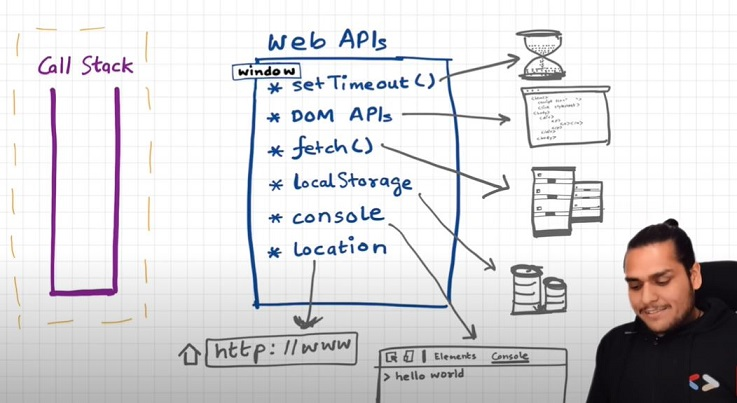
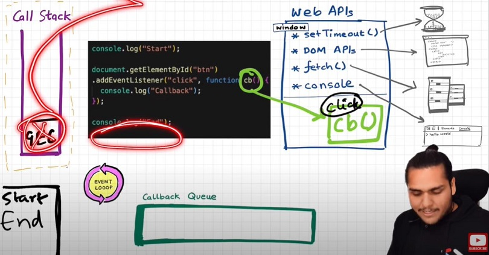
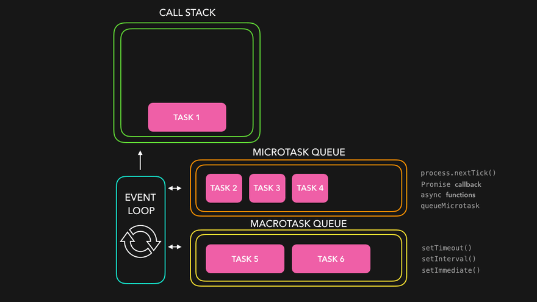
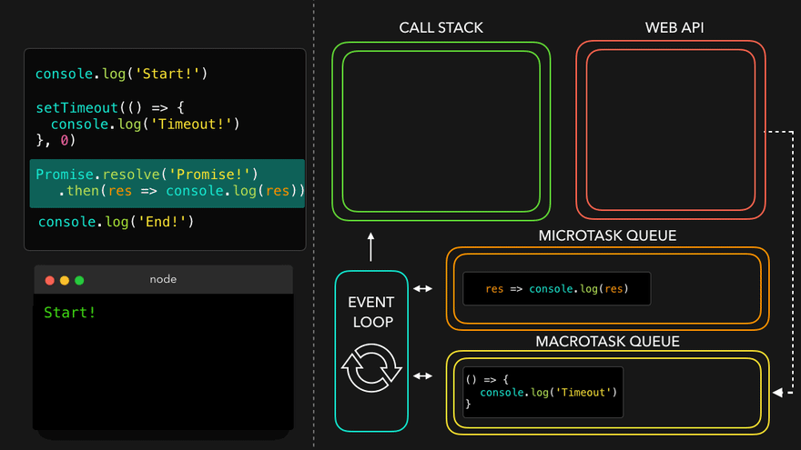

# Episode 15 : Asynchronous JavaScript & EVENT LOOP from scratch 

Note: The call stack executes any execution context that enters it without waiting for anything. Time, tide, and JavaScript wait for no one.

The browser has a JavaScript Engine, which contains the Call Stack. The call stack holds the Global Execution Context, Local/Function Execution Context.

However, the browser also has many other capabilities, such as local storage, timers, URL handling, Bluetooth access, geolocation, and more.
JavaScript needs a way to connect the call stack to these browser features, and this is done through Web APIs.


# Web-API

A Web API (short for Web Application Programming Interface) is a set of browser-provided functionalities that allow JavaScript to interact with features outside of the JavaScript engine itself. In simple terms, Web APIs act as a bridge between JavaScript and the browser’s built-in capabilities, such as -

**Timers**: Functions like setTimeout() and setInterval() that let you run code 'after a specific delay' or 'repeatedly at a set interval.'

**DOM Manipulation**: Methods like document.querySelector() and addEventListener() that let you access, change, or interact with elements on a webpage.

**Fetch API**: A way to make HTTP requests to get data from servers or send data to them.

**Local Storage & Session Storage**: Local Storage keeps data even after a page refresh or browser restart, while Session Storage keeps data only for the current tab session.

**Geolocation API**: Lets you get the geographical location of the user, like latitude & longitude.

**Bluetooth API**: Allows your web app to 'discover & connect' to nearby Bluetooth devices.

**Canvas API**: Lets you draw and render graphics, images, and animations directly on the webpage using 'an HTML canvas element.'

**WebSockets**: Enables real-time, two-way communication between the browser and a server, useful for live chat apps or data updates.

**Notification API**: Allows the browser to display desktop notifications to the user.

**Console API**: A Web API that provides methods to print messages and log information to the browser's console.

None of the following are part of JavaScript itself! These are additional superpowers that the browser provides. The browser grants the 'JavaScript call stack' access to these features.



* We access all these Web APIs through the global object, which is window in the browser.
For example, you can use the window keyword to call these functions, like: window.setTimeout(), window.localStorage, window.console.log() to print something to the console.

* Since window is the global object, and all these functions are properties of the global object, we don’t explicitly write window—it’s implied. For example, just writing setTimeout() works the same as window.setTimeout().

* Let's understand the code in the image below and its explanation:

    

    * ```js

      console.log("start");
      setTimeout(function cb() {
      console.log("timer");
      }, 5000);
      console.log("end");


      // output:
      // start
      // end
      // timer

      ```

* First, a Global Execution Context **(GEC)** is created and pushed onto the call stack.

* **console.log("Start");** - This calls the Console Web API (through the window object) to print "Start" on the console. Since console.log() is synchronous, it immediately logs the value.

* **setTimeout(function cb() { console.log("Timer"); }, 5000);** - This calls the setTimeout() Web API, which gives access to the timer feature.

* The Web API environment stores the callback function cb() and starts the 5-second timer.
setTimeout() returns right away and doesn’t pause the main thread.

* **console.log("End");** - This again calls the Console Web API to print "End" on the console.

* After this line, the Global Execution Context (GEC) is popped from the call stack.

* Meanwhile, the timer continues to run in the background.Once the timer reaches 0, the callback function cb() is moved to the **Callback Queue**.However, for the callback to be executed, it needs to enter the call stack.This is where the **Event Loop** comes into play.

* **The Event Loop** continuously checks whether the call stack is empty.Once it finds the call stack empty, it pushes the callback function from the Callback Queue to the call stack for execution.
Finally, the cb() function executes, printing "Timer" to the console.


# Q: How is "timer" logged to the console after 5 seconds?

* The cb() function does not directly go to the call stack when the timer expires. Instead, it goes to the Callback Queue.

* The Event Loop continuously checks the Callback Queue to see if it contains any function that needs to be executed. Think of it as a gatekeeper.

* Once the cb() function is in the Callback Queue, the Event Loop pushes it to the call stack when the stack is empty.Inside the callback we have console statemnent.

* Finally, the call stack connects with the Console API to log "timer" into the console window.

* 

# Q: Another example to understand Eventloop & Callback Queue.

* ```js
  console.log("Start"); // Uses the console API to print "Start" to the console

  document.getElementById("btn").addEventListener("click", function cb() {

  console.log("Callback"); // When the click event is triggered, this uses the console API to print "Callback" to the console.
  
  }); 
  
  // cb() gets registered inside the Web API environment, and the click event is attached to it.

  console.log("End"); // Uses the console API to print "End" to  the console.
  
  // After this, the Global Execution Context (GEC) is removed from the call stack.

  ```
  
* In the above code, even after "Start" and "End" are printed and the GEC is popped out, the event listener remains in the Web API environment, waiting for a click event to trigger it. It stays there until it is explicitly removed or the browser is closed.



# What is Event Loop?

* The Event Loop has just one job: it continuously monitors both the Callback Queue and the Call Stack. It acts like a gatekeeper. If it finds any code blocks or functions waiting in the callback queue, it pushes them one by one into the call stack for execution and removes them from the callback queue.

* However this only happens when the call-stack is completely empty (i.e. no synchronous code is being executed).

# Need for callback/message queue?

Ans: Suppose the user clicks a button 6 times. As a result, 6 callback functions (cb()) are placed inside the Callback Queue. At this moment, the Event Loop continuously checks whether the Call Stack is empty or not.
If the call stack is empty, the Event Loop pushes the callbacks one by one from the callback queue into the call stack for execution. This process continues until all the callbacks have been executed.

# Behavior of fetch (Microtask Queue):

Let's observe the code below and try to understand.

```js

console.log("Start"); 

setTimeout(function cbT() { 
  console.log("CB Timeout");
}, 5000);

fetch("https://api.netflix.com").then(function cbF() {
    console.log("CB Netflix");
}); 

// Million lines of code 

console.log("End"); 

```
**Code Explanation** 

* In the first line, the JS engine communicates with the console Web API and logs "Start" in the console window.

* In the next line, setTimeout takes the callback function **cbT** and stores it in the Web API environment, attaching a timer of 5 seconds to it.

* Moving forward, JS encounters the fetch method (provided by the browser), which makes an API call. Before making the API call, fetch takes the callback function **cbF** and stores it in the Web API environment. After that, it sends a request to the server.

* At this moment, both cbF and cbT functions are stored in the Web API environment.

* Meanwhile, the JS engine keeps executing the next million lines of code in the call stack. When the 5-second timer attached to cbT expires, cbT is pushed into the Callback Queue. Similarly, when the data is returned from the server for the fetch API, cbF is pushed into the Microtask Queue.

* The Microtask Queue works similarly to the Callback Queue, but it has a higher priority. Functions in the Microtask Queue are executed before those in the Callback Queue.

* When JS finishes executing the last line of code (console.log("End")), the call stack becomes empty. At this moment, the function inside the Microtask Queue (cbF) is pushed into the call stack and gets executed. After cbF completes execution, the call stack is empty again. Then, the function from the Callback Queue (cbT) is pushed into the call stack and executed.

* These operations of pushing functions from the Microtask/Callback Queue to the call stack are performed by our hero—the Event Loop.

* Refer to the image below for better understanding.


Microtask Priority Visualization



**Some Important Questions**

# 1. When does the event loop actually start?

The Event Loop is a single-threaded loop that keeps running non-stop, constantly checking for tasks to execute.

# 2. Are only asynchronous web API callbacks registered in the Web API environment?

Yes, synchronous callback functions (like those passed to map, filter, and reduce) are not registered in the Web API environment. Only asynchronous callback functions go through the entire event loop process.

# 3. Does the Web API environment store only the callback function and push the same callback to the queue/microtask queue?

Yes, the callback functions are stored, and a reference is added to the right queue.The Web API does NOT copy the whole callback function into the queue.
Instead, it just puts a pointer (a link) to that function. For event listeners (like click handlers), the original callbacks stay in the Web API environment forever. That’s why it’s a good idea to remove event listeners when you don’t need them anymore so the garbage collector can clean up.


# 4. What happens if the delay for setTimeout() is set to 0ms?

Even with a delay of 0ms, the callback does NOT run immediately.
It is placed in the Callback Queue and waits until the call stack is empty.
So if JavaScript Call stack is busy, the '0ms' callback can actually run later than 0ms.

**How does it work?**

Timer Initialization: The Web API environment stores the callback function from setTimeout() and starts the timer.

Timer Expiry: Once the timer ends (even if it’s 0ms), the callback is moved to the Callback Queue.

Event Loop Check: The Event Loop continuously checks whether the Call Stack is empty.

If the Call Stack is empty, it moves the callback from the Callback Queue to the Call Stack for execution.If the Call Stack is busy, the callback remains in the queue until it gets a chance to execute.

**Why are Promise Callbacks Faster?**

Callbacks from Promises (like fetch().then()) go to the Microtask Queue, which has higher priority than the Callback Queue. This means Microtask Queue callbacks will always execute before setTimeout() callbacks, even if the delay is 0ms.

# 5. What enters the Microtask Queue?

**Promises**: Callback functions from promises (like .then() and .catch()) always go into the Microtask Queue.

**Mutation Observers**: These are used to monitor changes in the DOM. When a change occurs, the callback function goes into the Microtask Queue.

**The Microtask Queue** has a higher priority than the Callback Queue (also known as the MacroTask Queue). If the Microtask Queue keeps adding new tasks, the Callback Queue may never get a chance to run. This problem is known as starvation. Examples of Callback Queue Tasks: Callbacks from setTimeout() and setInterval().Event listener callbacks (such as clicks or keyboard events)

**Observation of Eventloop, Callback Queue & Microtask Queue [**GiF**]**


 



# 6. What is the Web API Environment?

When JavaScript encounters asynchronous operations (like setTimeout, fetch, or DOM events), it offloads them to the Web API Environment provided by the browser. This environment handles tasks asynchronously without blocking the main thread (call stack).

# 7. How Does fetch() Work?

```js


fetch("https://api.netflix.com")
  .then(function cbF(response) {
      console.log("Response object:", response);
  });

```

When you make a fetch() request, the following sequence of events takes place:

Initiating the Request:

fetch() sends an HTTP request to the server.
The .then() callback (cbF) is registered and kept by the Web API while the request is in progress.
The request is asynchronous, so JavaScript continues executing the next lines without waiting.

Receiving the Response:

When the server sends the response, the response object is created and stored in heap memory.
The Web API then places a reference to the callback function (cbF) into the Microtask Queue (because .then() = microtask).

Executing the Callback:

The Event Loop checks whether the call stack is empty.
When empty, it moves the callback from the Microtask Queue → Call Stack.
The callback runs, and it can access the response object stored in the heap.

Key Points:

The Web API stores only a reference to the callback while waiting for the response.
The response data itself lives in the heap memory, not in the queue.
When the response arrives, the callback reference goes to the Microtask Queue.
When executed, the callback reads the data directly from the heap.

# 8. How Does setTimeout() Work?

```js

setTimeout(function cbT() { 
  console.log("CB Timeout");
}, 5000);

```
When you use setTimeout(), the following sequence of events takes place:

**Setting Up the Timer:**

When the setTimeout() function is called, it takes two arguments:
A callback function to be executed later (e.g., cbT).
A delay time in milliseconds (e.g., 5000 ms = 5 seconds).
The callback function (cbT in your example) is stored in the Web API Environment, and a timer is started.

**Timer Countdown:**

The timer counts down asynchronously without blocking the main thread.
During this time, JavaScript continues executing the next lines of code in the Call Stack.


**Timer Completion:**

Once the timer finishes counting down (after 5 seconds in this case), the callback function (cbT) is moved from the Web API Environment to the Callback Queue (also known as the MacroTask Queue).


**Callback Execution:**

The Event Loop checks if the Call Stack is empty.
If it is, the Event Loop moves the callback function from the Callback Queue to the Call Stack.
Finally, the callback function (cbT) gets executed.

**Key Points:**

The Web API Environment only holds the callback function reference and the timer.
When the setTimeout timer finishes, the browser places a reference to the callback into the Callback Queue.
If the Call Stack is busy, the callback will wait in the Callback Queue even after the timer ends.
The Event Loop moves callbacks from the Callback Queue to the Call Stack whenever the Call Stack is empty.


# 9. How addEventListener() Works?

```js

  document.getElementById("btn").addEventListener("click", function cb() {

  console.log("Callback"); // When the click event is triggered, this uses the console API to print "Callback" to the console.
  
  });

```

**Setting Up the Listener:**

When you call addEventListener() to attach an event (like "click") to an element, the callback function is registered in the Web API Environment. The browser keeps track of this listener and continuously monitors for the specified event (e.g., a click on a button).

**Event Triggered:**

When the event (like a button click) occurs, the browser creates an event object containing details about the event (like target, type, timestamp, etc.). This event object is stored in Heap memory, as it needs to be dynamically accessed.

**Moving to Callback Queue:**

The Web API Environment sends the callback function (along with a reference to the event object) to the Callback Queue.

**Event Loop Checks:**

The Event Loop constantly checks if the Call Stack is empty. Once it’s empty, it takes the callback from the Callback Queue and pushes it onto the Call Stack.

**Executing the Callback:**

The callback executes and accesses the event object. After the callback finishes, the event object becomes eligible for garbage collection if no references remain. The actual memory cleanup happens later when the garbage collector runs.


# 10 . How does the console Web API work?

**Understanding the Console API:**

The console object is a built-in Web API provided by the browser that allows developers to log messages, errors, and other information to the browser's console. It is not a part of the JavaScript language itself but is implemented by browsers and runtime environments (like Node.js).

**When You Use console.log():**

When you use console.log(),The function call console.log() enters the Call Stack.
The console.log() method itself is a synchronous operation. It immediately prints the message to the console without waiting for any asynchronous tasks.

**Behind the Scenes:**

The message to be logged (like "Hello World") is sent to the Console API, which is managed by the browser's internal system.
The browser takes the message and displays it in the Console panel of the DevTools.

**Where Is the Data Stored?**

The actual log message does not go through any queue (like the Callback or Microtask Queue) since it’s not asynchronous.
The browser engine handles the printing directly to the console output, and there is no specific memory location dedicated to storing the console logs.

**When Is It Cleared?**

Console logs are usually cleared when you manually clear the console or reload the page.
Some environments, like Node.js, print logs to the terminal instead of the browser console.

**Note:** When you call console.log(), the message is directly sent to the Console API, which immediately prints it to the console. It doesn’t go through the Web API Environment, Callback Queue, or Event Loop since it’s synchronous.


# 11. Why Does fetch() Use the Microtask Queue and setTimeout() Use the Callback Queue?

The Microtask Queue has higher priority than the Callback Queue.
Tasks in the Microtask Queue are executed immediately after the current stack is empty, even before any Callback Queue tasks.
This is because Microtasks (like Promises and Mutation Observers) are considered more important and should be handled promptly.


# 12. Where Is Console Data Stored?

**Temporary Memory:**

The browser allocates some temporary memory to hold the log messages.This memory is managed internally by the DevTools and is not part of JS memory.
The console messages are stored in a buffer that is maintained as long as the DevTools are open or until the page is refreshed.
When you reload the page, the console logs are typically cleared unless you enable the "Preserve log" option in DevTools.


**Internal Implementation:**

The exact way logs are stored can vary between browsers, but generally, they are kept in a circular buffer.
This means that after reaching a certain limit, older logs are discarded to make room for new ones.


**Note:** The Callback Queue is also known as the MacroTask Queue or simply the Task Queue. 

<hr>

Watch Live On Youtube below:

<a href="https://www.youtube.com/watch?v=8zKuNo4ay8E&ab_channel=AkshaySaini" target="_blank"></a>