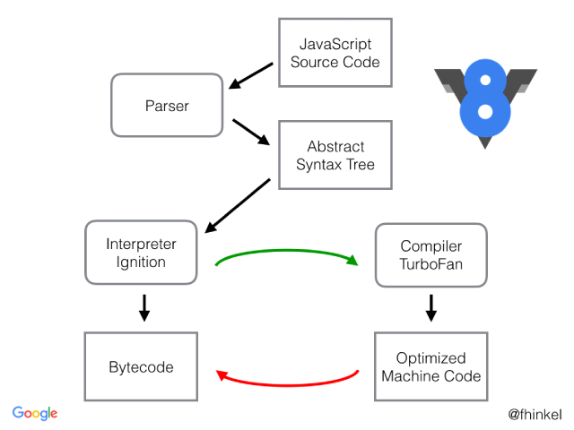

# Episode 16: JS Engine Exposed, Google's V8 Architecture

-> JavaScript runs almost everywhere, from smartwatches and robots to web browsers, thanks to the JavaScript Runtime Environment (JRE).

-> The JRE acts like a large container that includes everything needed to execute JavaScript code.

-> The JRE consists of a JavaScript engine (the ❤️ of the JRE), a set of APIs to connect with the external environment, the event loop, the callback queue, the microtask queue, and more.

-> A browser can execute JavaScript code because it contains the JavaScript Runtime Environment.

-> ECMAScript is like the rulebook for JavaScript. It sets the guidelines that all JavaScript engines have to follow.

-> Different browsers use different engines to run JavaScript:

    - Chakra for Microsoft Edge
    - SpiderMonkey for Firefox (it was the first-ever JavaScript engine, made by the creator of JavaScript)
    - V8 for Chrome

-> Think of ECMAScript as the recipe, and each engine as a different chef following that recipe to prepare the same dish (execute JavaScript code) consistently.

-> A JavaScript engine is not a physical machine but software written in low-level languages (like C++) that takes high-level JavaScript code and converts it into low-level machine code.


# JS Engine Architecture

The JavaScript engine processes code through three main steps: Parsing, Compilation, and Execution. Let's break down each step in an easy-to-understand way while diving deep into the concepts.


# 🚀 What is Parsing?

-> Parsing is the process where the JavaScript engine analyzes your code and converts it into a **structured** format the machine can understand.

-> Think of parsing as translating your code from something a human wrote to something a machine can work with.

#**📝 Step 1: Tokenization (Lexical Analysis) -**

Tokenisation is the first step of parsing where the JS engine converts source code into small meaningful units called tokens

🧩 Why does JavaScript need tokenisation?

Because JavaScript cannot understand your raw text.Before JS can execute anything, it must first scan your code and break it into parts that the engine understands.

🧩 What Are Tokens?

Tokens are tiny chunks of your code that carry meaning. Each token is like a small, labeled piece of your code.

Example: Take this simple line -

let x = 5;

The engine breaks this line into tokens like -

let - A keyword (for declaring variables)
x - An identifier (the variable name)
= - An operator (assignment)
5 - A literal value (number)
; - A terminator (marks the end of a statement)


**🌲 Step 2: Building the AST (Syntax Analysis)**

After tokenisation, JavaScript now has a list of tokens.
But tokens alone don’t tell the structure of the program.
So the next step is Syntax Analysis.
This step organizes tokens into a meaningful tree structure → the AST (Abstract Syntax Tree).


🧩 What is an AST?

An AST is just a diagram that shows how your code is structured.

Think of AST Like This. Imagine you write a sentence: "I eat apples."

Now imagine turning that sentence into a structure - 

Who? → I
Action? → eat
What? → apples

This is exactly what an AST does for code.

🧩 AST Representation of let x = 5;

Program
├── VariableDeclaration (let)
    └── VariableDeclarator
        ├── Identifier (x)
        └── Literal (5)

Node-by-node explanation -

Program - The root node — represents the entire JavaScript file.

VariableDeclaration (let) - Shows you're declaring a variable using let.

VariableDeclarator - Shows that declaration has a variable name and a value.

Identifier (x) - The variable name.

Literal (5) - The actual value stored inside the variable.


🧩 Why Do We Need an AST?

The AST allows the JS engine to:

**Understand the code**

👉 What variables exist.

Example -
let a = 10;
const b = 20;
var c = 30;

AST will say:

Variable a exists (type: let)
Variable b exists (type: const)
Variable c exists (type: var)

This helps the engine create the Variable Environment / Scope.


👉 Where functions start and end.

Example - 

function greet(name) {
  console.log("Hello " + name);
}

The AST breaks it like this:

FunctionDeclaration (greet)
  ├── params: [ "name" ]
  └── body:
        console.log("Hello " + name)

AST clearly marks:

Start: function greet(name) {
End: }

This lets the engine know - Everything inside { ... } belongs to this function.

👉 What expressions belong together.

Example -

5 + 3 * 2
Does 5 belong with + ?
Does 3 belong with * 2 ?

The AST groups correct expressions like
(3 * 2) belongs together
5 + (result) belongs together

Without AST, the engine wouldn’t know priority, order & grouping


👉 What operation happens first - 
 
Example - 
5 + 3 * 2
Humans know 3 * 2 happens first.
But the engine doesn’t know that automatically.
The AST determines it.

AST decides:
First → 3 * 2  
Then → 5 + (result)

**Apply optimizations**

The engine uses AST to -

👉remove unreachable code -

Example - 
function test() {
  return 10;
  console.log("This will never run");
}

The line after return can NEVER be executed, so it is unreachable.

The AST tells the engine:

Where each statement is
What the control flow looks like
Where return/break/throw statements appear
Which code sections cannot be reached logically

When the AST is built, the engine sees something like:

FunctionDeclaration
 ├─ ReturnStatement (10)
 └─ ExpressionStatement (console.log)

The engine examines the AST and realizes: After ReturnStatement, the function ends.

Therefore: ❌ Everything under it is unreachable. So the engine removes it before execution.

👉inline functions -

Inlining means - Replacing a function call with the function’s actual code instead of calling the function at runtime.

function add(a, b) {
  return a + b;
}
let x = add(5, 10);

After inlining let x = 5 + 10;

👉improve loop performance

👉optimize memory usage 

The AST tells the engine:

which variables are used
which variables aren’t used
when a variable stops being needed
how long scopes live
what can be reused
what can be discarded early

Example 1 -

```js

function test() {
  let a = 5;
  let b = 10; // never used
  return a;
}

```
AST shows a node for b that is never referenced.Engine removes b entirely.

Example 2 - 

```js
{
  let x = 100;
} // End of block
```

AST marks where scope starts and ends.

Engine knows x is needed only inside that block

After block ends → remove x from memory. Faster garbage collection.


**Generate machine instructions** - The AST becomes the blueprint for machine code.

**Catch syntax errors early** - If AST cannot be formed → SyntaxError.
Example: let x 5;
The parser expects an =
→ "Unexpected number".

🧪 How To See the AST Yourself

👉 Use AST Explorer https://astexplorer.net

Paste JS code → see the AST nodes instantly.


**Analogy: Sandwich Making (Simple + Perfect)**

👉Tokenisation = Breaking the Sandwich Into Ingredients.

Imagine you're about to make a sandwich.

Before making it, you separate everything:

Bread
Lettuce
Tomato
Cheese
Meat

This step is NOT making the sandwich.It's ONLY collecting ingredients.

Same in JavaScript: Tokenisation breaks your code into small pieces like keywords, variables, numbers, operators.

👉 Syntax Analysis (AST) = Understanding the Order & Meaning

Now just having ingredients is not enough.
You need a proper order to build the sandwich.

So you decide →

Bread → Lettuce → Tomato → Cheese → Meat → Bread

This step is organizing ingredients into a meaningful structure.

Same in JavaScript: Syntax analysis takes tokens and arranges them into a tree structure (AST) that shows:

which part belongs where
which thing comes first
what is inside what

AST = The Blueprint / Diagram of the Sandwich

Imagine you draw a diagram like this -

Sandwich
├── Top Bread
├── Lettuce
├── Tomato
├── Cheese
├── Meat
└── Bottom Bread


This is NOT the actual sandwich. It is just a map showing how the sandwich is structured.

Same in JavaScript: AST is a map of your code.

It tells the engine:

what is the root
what nodes are inside
what depends on what
what belongs where

⭐ ABSOLUTE ONE-LINER - 

Tokenisation/Lexical analysis -	Separate ingredients(sandwich version)-Split code into tokens(JS version)
Syntax Analysis	- Arrange ingredients in order(sandwich version) - Arrange tokens into AST(JS version)
AST -	Diagram of sandwich layers((sandwich version))-	Structured representation of code (JS version)


If you want, I can now explain JIT Compilation in the same sandwich style or developer style.


🚀 Compilation in JavaScript (JIT Compilation)
JavaScript is often thought of as an interpreted language, but that's not entirely true! Modern JavaScript engines (like V8 in Chrome and SpiderMonkey in Firefox) use something called Just-In-Time (JIT) Compilation. 
 
# Compilation phase in javascript?

Compilation is the process of translating high-level code (like JavaScript, C++, or Python) into machine code (binary instructions) that a computer's CPU can understand and execute.

In simple terms:  Your code (human-readable) → Compilation → Machine code (computer-readable)

**🚀 Understanding Compilation in JavaScript**

JavaScript uses something called Just-In-Time (JIT) Compilation, which combines both interpretation and compilation at runtime. This makes JavaScript a JIT-compiled language, which means:

-> Compilation and execution happen simultaneously(hand in hand) at **run time.**
-> The code is compiled just before it's executed, making it efficient and fast.

**📝 Step-by-Step Explanation of the Compilation Phase**


Bytecode Generation (Interpreter) - 
The AST is passed to the interpreter, which converts it into bytecode.
Bytecode is an intermediate representation that is more efficient to execute than the raw source code.
The bytecode is then executed line by line by the JavaScript engine.

JIT Compilation (Optimization) - 
While the interpreter is running the bytecode, The JIT compiler watches the bytecode.
The compiler keeps an eye on "hot code" (code that is executed frequently like loops, repeated functions) and optimizes it by converting it to machine code.
This machine code is directly executed by the CPU, making it extremely fast.


**💡 Why Compilation and Interpretation Together?**

JavaScript was initially an interpreted language, which means the code was executed line by line without being compiled. This was good for quick execution but slow for repetitive tasks.To improve performance, modern JS engines (like V8 in Chrome) introduced the JIT compiler that works alongside the interpreter

-> Interpreter: Quickly converts the code to bytecode and executes it.
-> JIT Compiler: Simultaneously analyzes and optimizes frequently executed code into machine code.


**💬 Does JavaScript Really Compile?**

Yes, absolutely! While it may seem like it’s being interpreted line by line, the JIT compiler is constantly compiling and optimizing the code during execution. So, JavaScript does compile, but it does so at runtime.

-> Compilation and execution happen together.
-> AST → Bytecode → Machine Code (through JIT).
-> Interpreter and JIT Compiler work hand in hand.
-> JavaScript was initially interpreted, but now it’s both compiled and interpreted due to JIT.


**📝 How JIT Compilation Works (Step by Step)** 

Bytecode Generation (Baseline Interpretation) - After parsing, the Abstract Syntax Tree (AST) is transformed into bytecode.Bytecode is an intermediate representation that is not as low-level as machine code but is more optimized than the original JavaScript source code.
The interpreter directly executes the bytecode. During execution, the compiler keeps track of hot code.

Hot Code Detection - The JIT compiler monitors the execution and identifies which code paths are executed repeatedly (hot code).
This analysis is based on: Loop executions , Frequently called functions , Repetitive code patterns.
This detection helps in deciding which code should be optimized.

Machine Code Generation (Optimization Phase) - Once the hot code is identified, the JIT compiler takes the bytecode of that section and compiles it into machine code.This machine code is highly optimized and directly executed by the CPU, significantly improving performance.

Optimizations During JIT Compilation - The JIT compiler applies several optimization techniques to make the generated machine code faster:

**1.Inline Caching:**

Stores the results of frequently accessed object properties to avoid repeated lookups.

Example:

```js

function getName(obj) {
    return obj.name;
}

```
If the function is called repeatedly with objects of the same structure, the engine caches the name property's memory location and skips repeated property lookups.

**2.Function Inlining (JIT Optimization)**

Function inlining is an optimization technique used by the JIT compiler to make code run faster.
Instead of calling a function every time, the compiler replaces the function call with the actual code from the function body.

**Why Is Function Inlining Performed?**

Calling a function takes time because the engine needs to:

-> Jump to the function’s location.
-> Execute the function.
-> Jump back to the calling code.

Inlining removes this overhead by directly putting the function’s logic where it’s called.

Example: 

    // Original code with a function call

    function square(x) {
        return x * x;
    }
    let result = square(5);  // Calls the function and stores the result


    // After inlining (optimized by JIT)

    let result = 5 * 5;  // Directly performs the calculation without a function call


**Benefits of Function Inlining:**

-> Faster Execution: Reduces the time spent on function calls.
-> Optimized Hot Paths: Converts frequently executed functions into direct operations for maximum speed.

**When Does Function Inlining Happen?**

-> The JIT compiler inlines small, frequently called functions where the speed gain is greater than the cost of extra code size.

-> Inlining replaces the function call with the actual function body, removing call overhead — but it also increases the total code size.

-> The JIT compiler carefully evaluates the trade-off between:
Performance Boost: Avoiding function calls improves execution speed.
Code Size Increase: Duplicated logic makes the overall code larger.

If the performance gain outweighs the cost of increased code size, the JIT compiler will inline the function. Otherwise, it may decide to keep the function call as it is.


**3.Type Specialization:**

JavaScript is a dynamically typed language, meaning variables can hold values of any type. This flexibility makes code slower because the engine needs to handle different types.

To make the code run faster, the JIT compiler tries to figure out what type of data a variable holds (like a number or a string) and stick with that type as much as possible. This way, it can create machine code that works really well with that specific type, rather than constantly checking and guessing the type while the code runs.

📝 Example:

let x = 5;
let y = x + 2;

What’s Happening here?

-> The engine sees that x is assigned the value 5, which is an integer.
-> The engine creates machine code that is specifically optimized to add integers rather than performing a generic addition that could work with any data type (like strings, floats, or objects).
-> This makes the operation faster because the engine doesn’t have to check if x is a string, float, or any other type.

**4.Dead Code Elimination:**

This concept is called "Dead Code Elimination". It means that the compiler gets rid of code that is never executed or doesn’t affect the final output.


function add(a, b) {
    return a + b;
    console.log("This is dead code");
}

The console.log statement is never executed because the function returns early, so it can be safely eliminated.

**5.Loop-Invariant Code Motion:**

Moves 'computations that do not change inside a loop' outside the loop to minimize redundancy.

for (let i = 0; i < 1000; i++) {
    let x = 5 * 10;  // Computed every time (inefficient)
    console.log(x + i);
}

Optimization: Move let x = 5 * 10; outside the loop.


**🚨 What is Deoptimization (Bailout)?**

Sometimes, the JIT compiler makes assumptions to optimize the code, like assuming a variable will always be a number. But if that assumption turns out to be wrong (for example, the variable suddenly holds a string), the optimized code becomes useless.

In such cases:

-> The JIT compiler throws away the optimized machine code.
-> It switches back to slower, interpreted bytecode that can handle the unexpected situation.
-> This process of discarding the optimized code and falling back to interpreted code is called deoptimization or bailout.

**🚀 Why JIT is Better**

🚀 Why JIT is Better (Easy)

-> Starts Fast: Runs the code immediately like an interpreter.
-> Gets Faster Over Time: Optimizes hot code into machine code while running.
-> Adapts Automatically: Adjusts to changes in your code, perfect for dynamic JavaScript.


# 🚀 Execution Phase in JavaScript

The Execution Phase is the final and most crucial phase in the JavaScript engine's code processing pipeline. This is where the compiled machine code gets executed, and the program runs. Let’s break down this phase step by step!

**📝 What Happens During the Execution Phase?**

**1.Memory Allocation:**

-> The JavaScript engine allocates memory to store variables, objects, functions, and other data.
-> This memory is stored in a special area called the Memory Heap.
-> The Memory Heap is an unstructured region where objects and variables reside during execution.

Think of it as a big storage room where the engine puts things it needs while running the code.


**2.Execution Context and Call Stack:**

-> JavaScript creates an Execution Context for every function call, which contains all the information needed to execute the function.
-> These contexts are managed using the Call Stack.
-> The Call Stack is a data structure that works like a stack of plates—Last In, First Out (LIFO).
-> When a function is called, it is pushed onto the stack.
-> When a function completes, it is popped off the stack.

📌 Example:

```js

function greet() {
    console.log("Hello");
}
function main() {
    greet();
}
main();

```

Call Stack Operations:

-> main() is called → Pushed onto the stack.
-> Inside main(), greet() is called → Pushed onto the stack.
-> greet() completes → Popped off the stack.
-> main() completes → Popped off the stack.


**3.Garbage Collection:**

JavaScript uses Garbage Collection to automatically clean up unused memory.The most common algorithm used is Mark and Sweep.

Mark and Sweep Algorithm -

-> The engine "marks" objects that are reachable (i.e. can be accessed).
-> It "sweeps" away unmarked (unreachable) objects, freeing up memory.

Why Mark and Sweep?

JavaScript dynamically creates objects and variables. Without garbage collection, memory usage would continuously increase, causing memory leaks.


# Note -

Different companies develop their own JavaScript engines, each striving to make theirs the most efficient and high-performing.
Google’s V8 engine, used in Chrome and Node.js, features an interpreter called Ignition, a compiler called TurboFan, and a garbage collector named Orinoco.

v8 architecture: 


<hr>

Watch Live On Youtube below:

<a href="https://www.youtube.com/watch?v=2WJL19wDH68&ab_channel=AkshaySaini" target="_blank"></a>

Important -
VS Code’s syntax errors appear before execution because the editor uses its own static analysis tools (JS/TS language service, ESLint) to detect mistakes while you type.