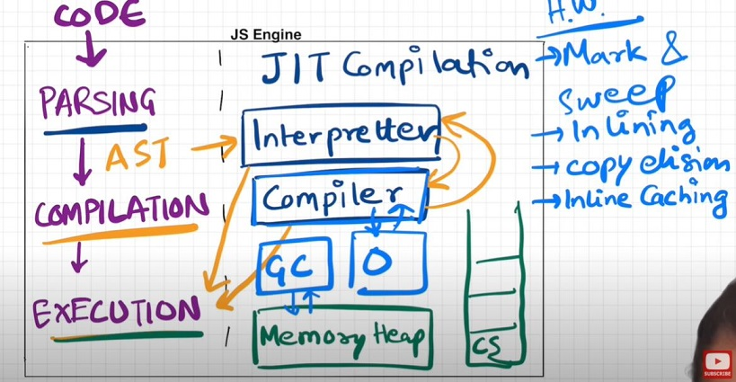

# Episode 16: JS Engine Exposed, Google's V8 Architecture

-> JavaScript runs almost everywhere, from smartwatches and robots to web browsers, thanks to the JavaScript Runtime Environment (JRE).

-> The JRE acts like a large container that includes everything needed to execute JavaScript code.

-> The JRE consists of a JavaScript engine (the ❤️ of the JRE), a set of APIs to connect with the external environment, the event loop, the callback queue, the microtask queue, and more.

-> A browser can execute JavaScript code because it contains the JavaScript Runtime Environment.

-> ECMAScript is like the rulebook for JavaScript. It sets the guidelines that all JavaScript engines have to follow.

-> Different browsers use different engines to run JavaScript:

    - Chakra for Microsoft Edge
    - SpiderMonkey for Firefox (it was the first-ever JavaScript engine, made by the creator of JavaScript)
    - V8 for Chrome

-> Think of ECMAScript as the recipe, and each engine as a different chef following that recipe to prepare the same dish (execute JavaScript code) consistently.

-> A JavaScript engine is not a physical machine but software written in low-level languages (like C++) that takes high-level JavaScript code and converts it into low-level machine code.

# JS Engine Architecture

The JavaScript engine processes code through three main steps: Parsing, Compilation, and Execution. Let’s break down each step in an easy-to-understand way while diving deep into the concepts.

# 🚀 What is Parsing?

-> Parsing is the process of analyzing your code and converting it into a structured format that the engine can understand.

-> Think of parsing as translating your code from something a human wrote to something a machine can work with.

**📝 Step 1: Tokenization (Lexical Analysis) -**

-> The first step of parsing is tokenization, also known as lexical analysis.

💡 What Are Tokens?

Tokens are tiny chunks of your code that carry meaning. Each token is like a small, labeled piece of your code.

💻 Example: Take this simple line:
let x = 5;

The engine breaks this line into tokens like:

let - A keyword (for declaring variables)
x - An identifier (the variable name)
= - An operator (assignment)
5 - A literal value (number)
; - A terminator (marks the end of a statement)

**🌲 Step 2: Building the AST (Syntax Analysis)**

Once the tokens are ready, the engine needs to organize them into a meaningful structure. This is where Syntax Analysis comes into play.

The output of this step is an Abstract Syntax Tree (AST). It’s called a tree because it has a root (the main code block) and branches (representing expressions and statements).

🛠️ What Does an AST Look Like?

-> An AST is like a map that shows how the code is structured. 

AST Representation of let x = 5;

Here’s how the AST actually looks:

Program
├── VariableDeclaration (let)
    └── VariableDeclarator
        ├── Identifier (x)
        └── Literal (5)

Explanation:

-> Program: The root node that represents the entire script.
-> VariableDeclaration (let): A node that shows we’re declaring a variable using let.
-> VariableDeclarator: A node that shows an assignment operation.
-> Identifier (x): The name of the variable being declared.
-> Literal (5): The value being assigned to the variable.

Why Do We Need an AST?

The AST is crucial because it helps the engine understand:

-> What variables are being declared
-> What functions are being defined
-> What operations are being performed

How the code is structured ?

The AST makes it easy for the engine to analyze and optimize the code before actually executing it.

❗Errors During Parsing-

Sometimes, the parsing step fails because your code has syntax errors.

For example:
let x 5;
Here, the parser will throw an "Unexpected number" error because it expects an = after x.

🕵️ How to See the AST Yourself -

You can actually visualize the AST of your code using a tool like AST Explorer. Just paste your code there, and it will show you the AST representation.

Key Points -

-> Tokenization: Breaks code into tiny chunks called tokens.
-> Syntax Analysis: Combines tokens into a structured format called the AST.
-> Purpose: Helps the engine analyze, understand, and optimize the code.
-> Error Handling: Catches syntax errors during this phase.

Analogy: Think of parsing as making a sandwich: 🥪

-> Tokenization: This is like gathering and identifying each ingredient separately. You have:

    - Bread 🍞
    - Lettuce 🥬
    - Tomato 🍅
    - Cheese 🧀
    - Meat 🍖

-> Syntax Analysis: Now you figure out the order of ingredients to make the sandwich correctly. You can’t put cheese on top of the bread and then put lettuce under it — it wouldn’t make sense! You organize the ingredients like this:

    Bread → Lettuce → Tomato → Cheese → Meat → Bread

-> AST (Abstract Syntax Tree): Imagine having a sandwich diagram that shows how each layer is stacked. It’s like a visual guide that helps you put everything in the right order.

-> In short: Parsing is like breaking down the sandwich ingredients, organizing them in the correct order, and using a diagram to assemble it step by step! 🥪

🚀 Compilation in JavaScript (JIT Compilation)
JavaScript is often thought of as an interpreted language, but that's not entirely true! Modern JavaScript engines (like V8 in Chrome and SpiderMonkey in Firefox) use something called Just-In-Time (JIT) Compilation. Let's understand what that means.

# Compilation phase in javascript?

Compilation is the process of translating high-level code (like JavaScript, C++, or Python) into machine code (binary instructions) that a computer’s CPU can understand and execute.

In simple terms:  Your code (human-readable) → Compilation → Machine code (computer-readable)

**🚀 Understanding Compilation in JavaScript**

JavaScript uses something called Just-In-Time (JIT) Compilation, which combines both interpretation and compilation at runtime. This makes JavaScript a JIT-compiled language, which means:

-> Compilation and execution happen simultaneously (hand in hand).
-> The code is compiled just before it's executed, making it efficient and fast.

**📝 Step-by-Step Explanation of the Compilation Phase**

AST Generation -
After parsing the code, an AST (Abstract Syntax Tree) is generated.
This tree structure represents the syntax and structure of the code.
Think of it as a blueprint for the code that tells the engine what to do.

Bytecode Generation (Interpreter)
The AST is passed to the interpreter, which converts it into bytecode.
Bytecode is an intermediate representation that is more efficient to execute than the raw source code.
The bytecode is then executed line by line by the JavaScript engine.

JIT Compilation (Optimization)
While the interpreter is running the bytecode, the JIT compiler is also working simultaneously.
The compiler keeps an eye on "hot code" (code that is executed frequently) and optimizes it by converting it to machine code.
This machine code is directly executed by the CPU, making it extremely fast.

**💡 Why Compilation and Interpretation Together?**

JavaScript was initially an interpreted language, which means the code was executed line by line without being compiled. This was good for quick execution but slow for repetitive tasks.To improve performance, modern JS engines (like V8 in Chrome) introduced the JIT compiler that works alongside the interpreter

-> Interpreter: Quickly converts the code to bytecode and executes it.
-> JIT Compiler: Simultaneously analyzes and optimizes frequently executed code into machine code.

**💬 Does JavaScript Really Compile?**

Yes, absolutely! While it may seem like it’s being interpreted line by line, the JIT compiler is constantly compiling and optimizing the code during execution. So, JavaScript does compile, but it does so at runtime rather than before execution.

-> Compilation and execution happen together.
-> AST → Bytecode → Machine Code (through JIT).
-> Interpreter and JIT Compiler work hand in hand.
-> JavaScript was initially interpreted, but now it’s both compiled and interpreted due to JIT.

**📝 How JIT Compilation Works (Step by Step)** 

Bytecode Generation (Baseline Interpretation) - After parsing, the Abstract Syntax Tree (AST) is transformed into bytecode.Bytecode is an intermediate representation that is not as low-level as machine code but is more optimized than the original JavaScript source.
The interpreter directly executes the bytecode.During execution, the interpreter keeps track of hot code (frequently executed paths).

Hot Code Detection - The JIT compiler monitors the execution and identifies which code paths are executed repeatedly (i.e., hot code).
This analysis is based on: Loop executions , Frequently called functions , Repetitive code patterns.
This detection helps in deciding which code should be optimized.

Machine Code Generation (Optimization Phase) - Once the hot code is identified, the JIT compiler takes the bytecode of that section and compiles it into machine code.This machine code is highly optimized and directly executed by the CPU, significantly improving performance.

Optimizations During JIT Compilation - The JIT compiler applies several optimization techniques to make the generated machine code faster:

**1.Inline Caching:**

Stores the results of frequently accessed object properties to avoid repeated lookups.

Example:

function getName(obj) {
    return obj.name;
}

If called multiple times with the same object structure, the engine caches the location of name and avoids repeated lookups.

**2.Function Inlining (JIT Optimization)**

Function inlining is an optimization technique used by the JIT compiler to make code run faster.
Instead of calling a function every time, the compiler replaces the function call with the actual code from the function body.

**Why Is Function Inlining Performed?**

Calling a function takes time because the engine needs to:

-> Jump to the function’s location.
-> Execute the function.
-> Jump back to the calling code.

Inlining removes this overhead by directly putting the function’s logic where it’s called.

Example: 

    // Original code with a function call

    function square(x) {
        return x * x;
    }
    let result = square(5);  // Calls the function and stores the result

    // After inlining (optimized by JIT)

    let result = 5 * 5;  // Directly performs the calculation without a function call

**Benefits of Function Inlining:**

-> Faster Execution: Reduces the time spent on function calls.
-> Efficient Code: Makes hot (frequently used) code paths faster.

**When Does Function Inlining Happen?**

-> Function inlining usually happens for small and frequently called functions where the performance gain is greater than the drawback of increasing the code size.

-> Inlining a function means replacing a function call with the actual code from the function. This makes the code faster because it eliminates the function call overhead. However, inlining increases the code size, especially if the function is large or called many times.

-> The JIT compiler carefully evaluates the trade-off between:
Performance Boost: Avoiding function calls improves execution speed.
Code Size Increase: Duplicating the function’s code can make the overall size larger.
If the performance gain outweighs the cost of increased code size, the JIT compiler will inline the function. Otherwise, it may decide to keep the function call as it is.

**3.Type Specialization:**

JavaScript is a dynamically typed language, meaning variables can hold values of any type. This flexibility makes code slower because the engine needs to handle different types.

To make the code run faster, the JIT compiler tries to figure out what type of data a variable holds (like a number or a string) and stick with that type as much as possible. This way, it can create machine code that works really well with that specific type, rather than constantly checking and guessing the type while the code runs.

📝 Example:

let x = 5;
let y = x + 2;

What’s Happening here?

-> The engine sees that x is assigned the value 5, which is an integer.
-> The engine creates machine code that is specifically optimized to add integers rather than performing a generic addition that could work with any data type (like strings, floats, or objects).
-> This makes the operation faster because the engine doesn’t have to check if x is a string, float, or any other type.

**4.Dead Code Elimination:**

This concept is called "Dead Code Elimination". It means that the compiler gets rid of code that is never executed or doesn’t affect the final output.

function add(a, b) {
    return a + b;
    console.log("This is dead code");
}

The console.log statement is never executed because the function returns early, so it can be safely eliminated.

**5.Loop-Invariant Code Motion:**

Moves computations that do not change inside a loop outside the loop to minimize redundancy.

for (let i = 0; i < 1000; i++) {
    let x = 5 * 10;  // Computed every time (inefficient)
    console.log(x + i);
}

Optimization: Move let x = 5 * 10; outside the loop.

**🚨 What is Deoptimization (Bailout)?**

Sometimes, the JIT compiler makes assumptions to optimize the code, like assuming a variable will always be a number. But if that assumption turns out to be wrong (for example, the variable suddenly holds a string), the optimized code becomes useless.

In such cases:

-> The JIT compiler throws away the optimized machine code.
-> It switches back to slower, interpreted bytecode that can handle the unexpected situation.
-> This process of discarding the optimized code and falling back to interpreted code is called deoptimization or bailout.

**🚀 Why JIT is Better**

-> JIT gives you the best of both worlds:
-> Fast Startup: Starts running the code quickly like an interpreter.
-> High Performance: Optimizes the code on the go like a compiler, making it faster as it runs.
-> Smart Adapting: Adjusts to changing code patterns, which is great for dynamic languages like JavaScript.

# 🚀 Execution Phase in JavaScript

The Execution Phase is the final and most crucial phase in the JavaScript engine's code processing pipeline. This is where the compiled machine code gets executed, and the program runs. Let’s break down this phase step by step!

**📝 What Happens During the Execution Phase?**

**1.Memory Allocation:**

-> The JavaScript engine allocates memory to store variables, objects, functions, and other data.
-> This memory is stored in a special area called the Memory Heap.
-> The Memory Heap is an unstructured region where objects and variables reside during execution.

Think of it as a big storage room where the engine puts things it needs while running the code.

**2.Execution Context and Call Stack:**

-> JavaScript creates an Execution Context for every function call, which contains all the information needed to execute the function.
-> These contexts are managed using the Call Stack.
-> The Call Stack is a data structure that works like a stack of plates—Last In, First Out (LIFO).
-> When a function is called, it is pushed onto the stack.
-> When a function completes, it is popped off the stack.

📌 Example:

function greet() {
    console.log("Hello");
}
function main() {
    greet();
}
main();

Call Stack Operations:

-> main() is called → Pushed onto the stack.
-> Inside main(), greet() is called → Pushed onto the stack.
-> greet() completes → Popped off the stack.
-> main() completes → Popped off the stack.

**3.Garbage Collection:**

JavaScript uses Garbage Collection to automatically clean up unused memory.The most common algorithm used is Mark and Sweep.

🔍 Mark and Sweep Algorithm:
-> The engine "marks" objects that are reachable (i.e., can be accessed).
-> It "sweeps" away unmarked (unreachable) objects, freeing up memory.

💡 Why Mark and Sweep?
JavaScript dynamically creates objects and variables. Without garbage collection, memory usage would continuously increase, causing memory leaks.

# Note -

Different companies develop their own JavaScript engines, each striving to make theirs the most efficient and high-performing.
Google’s V8 engine, used in Chrome and Node.js, features an interpreter called Ignition, a compiler called TurboFan, and a garbage collector named Orinoco.

v8 architecture: 

Watch Live On Youtube below:

