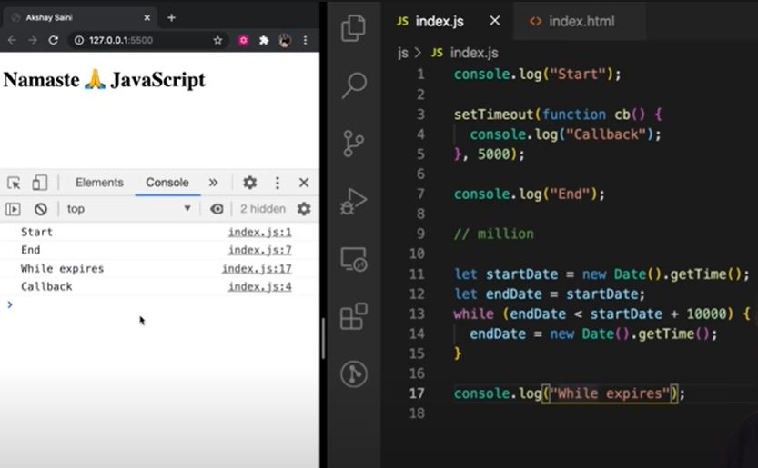

# Episode 17 : Trust issues with setTimeout() 

# Does setTimeout() Always Execute After the Given Time?

-> No! Contrary to popular belief, setting a timer for 5 seconds using setTimeout() does not guarantee that the callback function will execute exactly after 5 seconds. It might take longer—6, 7, or even 10 seconds. The actual execution time depends on the call stack.

**Let's Look at an Example**

    ```js

    console.log("Start");

    setTimeout(function cb() {
    console.log("Callback");
    }, 5000);

    console.log("End");

    // Imagine there are millions of lines of code here that take around 10 seconds to execute

    ```

**Output**

    Start  
    End  
    Callback  

The Callback does not necessarily execute exactly after 5 seconds. Sometimes it might take longer. But why does this happen?


**Reason?**

-> First, the Global Execution Context (GEC) is created and pushed onto the call stack.

-> When the JavaScript engine encounters console.log("Start");, "Start" is printed to the console.

-> Next, the engine encounters the setTimeout() function. At this point:
        - The callback function inside setTimeout() is registered in the Web API environment.
        - A timer of 5 seconds is attached to it and starts running.
        - The callback function now waits for its turn to be executed once the timer expires.
        - However, JavaScript doesn’t pause here — it immediately moves to the next line.    

-> Then, console.log("End"); is executed, and "End" is printed to the console.

-> After this, suppose there are 1 million lines of code that take around 10 seconds to complete.
        - The GEC remains on the call stack, continuously executing this long-running code.

-> Meanwhile, the timer that was set for 5 seconds continues to run in the background.

-> After 5 seconds, the timer completes, and the callback function is moved to the Callback Queue, waiting for its turn to be pushed onto the call stack.

-> The Event Loop continuously monitors whether the call stack is empty.
        - However, since the GEC is still in the call stack (because the long-running code is still executing), the callback function from the callback queue cannot be pushed to the call stack yet.

-> Even though setTimeout() was set for 5 seconds, the callback function has to wait for an additional 5 seconds (total of 10 seconds) until the GEC is popped off the call stack.

-> Once the GEC is popped (after completing the long-running code), the callback function is immediately pushed onto the call stack and executed.

-> This behavior is part of JavaScript's Concurrency Model, which shows that setTimeout() doesn’t guarantee exact timing. It only ensures that the callback is moved to the Callback Queue after the specified time, but its execution depends on the availability of the call stack.


# What if timeout = 0 seconds?

    ```js

    console.log("Start");
    setTimeout(function cb() {
    console.log("Callback");
    }, 0);
    console.log("End");

    ```
**output**

    Start  
    End  
    Callback  

-> Even when the timer is set to 0 seconds, the callback function still has to go through the event queue. The callback is first registered in the Web API environment, then moved to the callback queue, and finally executed once the call stack is empty.

-> Setting the timer to 0 seconds can be useful to defer a less important function so that a more important one (like printing "End" in this case) can execute first.


**Notes** 

-> The first rule of JavaScript: Do not block the main thread (since JavaScript is a single-threaded language with only one call stack). Avoid making the call stack run indefinitely or take an excessive amount of time to complete.

-> The setTimeout function guarantees that the callback will take at least the specified time to execute, but not necessarily exactly that time.

* JavaScript is a synchronous, single-threaded language, meaning it runs code sequentially using just one thread. It works like an interpreted language, executing code quickly inside the browser without waiting for compilation (thanks to JIT - Just-In-Time compilation). However, there are still ways to perform asynchronous operations.
 

# Blocking the main thread

Blocking the main thread means that the JavaScript engine is occupied with executing a long-running synchronous task, and during that time, it cannot perform any other tasks, including:

**Handling User Interactions:** The UI becomes unresponsive (like freezing or not reacting to clicks or inputs).

**Executing Asynchronous Callbacks:** Callbacks from functions like setTimeout, setInterval, or promises are delayed.

**Rendering Updates:** The browser cannot repaint or update the DOM, leading to a frozen or stalled interface.

* In the example below, we are blocking the main thread.



```js

console.log("Start");

setTimeout(function cb() {
  console.log("Callback");
}, 5000);

console.log("End");

let startDate = new Date().getTime();
let endDate = startDate;


// We're purposely creating a delay of 10 seconds and we're blocking the main thread. 
// While loop runs for 10 seconds . 

while (endDate < startDate + 10000) { // Loop runs for approximately 10 seconds
  endDate = new Date().getTime();
}

console.log("While expires");

// (startDate + 10000) is fixed in each iteration whereas (endDate) is variable in each iteration.

```

**How Are We Blocking the Main Thread?**

The main thread in JavaScript runs on a single-threaded execution model, meaning it can execute only one task at a time. If a task takes a long time to complete, the entire thread becomes blocked and cannot perform any other tasks until that long-running operation is finished.

**Code That Blocks the Main Thread:**

let startDate = new Date().getTime();
let endDate = startDate;
while (endDate < startDate + 10000) {  // Run for approximately 10 seconds
  endDate = new Date().getTime();
}


**What Makes This Code Blocking?**

Synchronous Execution:
-> The while loop runs synchronously on the main thread, meaning it does not yield control to other tasks.
-> The entire loop is executed without giving any break, so no other code (like callbacks) can be executed during this time.

Continuous Execution:
-> The while loop keeps running as long as the condition is true, which means it constantly checks the current time against the start time for 10 seconds straight.
-> The loop does not allow the call stack to be empty, making the GEC (Global Execution Context) stay in the call stack the entire time.

No Event Loop Interaction:

-> The Event Loop cannot do its job of moving callbacks from the Callback Queue to the Call Stack because the call stack is continuously occupied by the while loop.
-> This means any asynchronous task (like the setTimeout callback) will be stuck in the Callback Queue until the while loop finishes.


**Why Is This Problematic?**'

Freezing the UI:
-> In a browser, if the main thread is blocked, the UI becomes unresponsive, causing the entire application to freeze.
-> Any user interactions (like clicks, scrolls, or typing) are completely ignored until the blocking operation finishes.

Delayed Execution of Callbacks:
Even though the setTimeout callback was supposed to execute after 5 seconds, it gets delayed until the 10-second blocking operation completes.This can cause unexpected behavior and degrade performance.


# Why do developers often say that setTimeout has "trust issues" in JavaScript?

-> Developers say setTimeout has "trust issues" because it doesn't guarantee exact timing. Even if you set it for 5 seconds, the callback might not run right after that.

-> This happens because JavaScript is single-threaded, meaning it can only do one task at a time. The setTimeout callback is moved to the callback queue after the timer expires, but it will only be executed when the call stack is empty.

-> If the call stack is blocked by long-running code (like a heavy loop), the callback will be delayed. So, the actual execution time may be longer than expected.

-> This is why we say setTimeout has "trust issues" — it doesn't guarantee precise timing when the main thread is blocked.

<hr>

Watch Live On Youtube below:

<a href="https://www.youtube.com/watch?v=nqsPmuicJJc&ab_channel=AkshaySaini" target="_blank"></a>