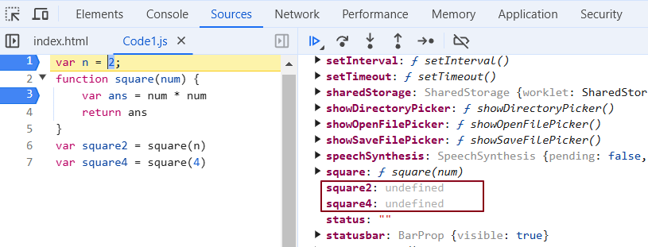

# Episode 2 : How JS is executed & Call Stack

* When a JS program is ran, a **global execution context** is created.

* The execution context is created in two phases.
  * Memory creation phase - JS will allocate memory to variables and functions.
  * Code execution phase

* Let's consider the below example and its code execution steps:
```js
var n = 2;
function square(num) {
 var ans = num * num;
 return ans;
}
var square2 = square(n);
var square4 = square(4);
```
The very **first** thing which JS does is **memory creation phase**, so it goes to line one of above code snippet, and **allocates a memory space** for variable **'n'** and then goes to line two, and **allocates a memory space** for **function 'square'**. When allocating memory **for n it stores 'undefined'**, a special value for 'n'. **For 'square', it stores the whole code of the function inside its memory space.** Then, as square2 and square4 are variables as well, it allocates memory and stores 'undefined' for them, and this is the end of first phase i.e. memory creation phase.In short, in **memory creation phase** JS skims through the entire code and allocates memory for variables and functions.

So O/P will look something like


Now, in **2nd phase** i.e. code execution phase, JS engine starts going through the entire code line by line. As it encounters 'var n = 2', it assigns 2 to 'n'. Until now, the value of 'n' was undefined. 

In the next line, JS encounters a function defination. For function, there is nothing to execute. As these lines were already dealt with in memory creation phase.

In the next line **var square2 = square(n)**, JS creates a new execution context for the function **square**.This execution context is known as **Function Execution Context (FEC)**.The way JS works is It creates a FEC when it comes across a function invocation / function call. Again in FEC, in memory creation phase, JS engine allocate memory to num and ans, the two variables. And undefined is placed in them. Now, in code execution phase of this FEC, first 2 is assigned to num. Then var ans = num * num will store 4 in ans. After that, 'return ans' returns the control of program back to where this function was invoked from.


When **return** keyword is encountered, It returns the control to the called line and also **the function execution context is deleted**.
Same thing will be repeated for square4 and then after that is finished, the global execution context will be destroyed.
So the **final diagram** before deletion would look something like:


**Call Stack**

* Javascript manages code execution context creation and deletion with the the help of **Call Stack**.

* **Call Stack** is a normal stack which follows LIFO (Last In First Out) principle.

* When JS executes a program , it creates a Global Execution Context (GEC) and pushes it to the bottom of the call stack.

* Within code execution phase of GEC When a function is invoked a new/Function Execution Context is created which is again pushed inside the stack. And the process goes on.

* When Function execution context is done with its two phases , it gets removed from the stack.

* Finally when the program execution is finished, The GEC gets removed from the stack.

* Call Stack maintains the order of execution of execution contexts. It is also known as Program Stack, Control Stack, Runtime stack, Machine Stack, Execution context stack.

<hr>

Watch Live On Youtube below:

<a href="https://www.youtube.com/watch?v=iLWTnMzWtj4&t=1s&ab_channel=AkshaySaini" target="_blank"></a>


<!-- Debugging -->

We have placed our breakpoint at the top of the code snippet.Even before a single line of code is executed, we can visually observe the memory creation phase, where variables are declared but initially assigned the value undefined.

In the figure below, the variables n, square2, and square4 are declared but remain undefined. 



As we step through the debugger, we can see these variables being assigned their actual values in real time. This occurs during the code execution phase.

Currently, we are at the Global Execution Context level. As we step into the function invocation, we can visually observe the same process in the Function Execution Context.