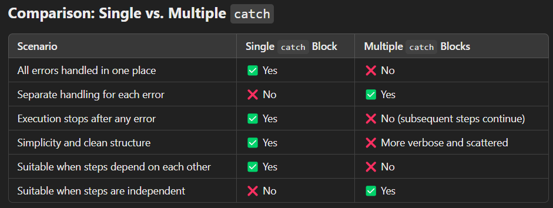

# Episode 21 (Season 2 : Episode 2) : Promises 


# 🌟 Promises in JavaScript

Promises are used to handle asynchronous operations in JavaScript. They provide a way to write cleaner and more manageable asynchronous code compared to traditional callback-based approaches.

A Promise is a javascript object that acts as a placeholder that represents a value that may not be available yet but will be at some point in the future.

It serves as a container for a future value that results from an asynchronous operation.

In other words, a Promise is an object that represents the eventual success or failure of an asynchronous task.


# 🛒 Example: E-Commerce Scenario

In an E-Commerce application, we often perform a series of asynchronous operations like:

-> Creating an order.
-> Proceeding to payment.
-> Showing order summary.
-> Sending a confirmation email.
-> Updating the wallet balance.


# Callback-Based Implementation (without Promises):**

```js

const api = {
  createOrder: function (cart, successCallback, errorCallback) {
    console.log("Creating order with items:", cart);
    setTimeout(() => {
      const isSuccess = Math.random() > 0.2;
      if (isSuccess) {
        const orderId = "ORD123"; // Simulated order ID
        console.log("✅ Order created successfully.");
        successCallback(orderId);
      } else {
        errorCallback("❌ Failed to create order.");
      }
    }, 1000);
  },

  proceedToPayment: function (orderId, successCallback, errorCallback) {
    console.log("Proceeding to payment for order:", orderId);
    setTimeout(() => {
      const isSuccess = Math.random() > 0.2;
      if (isSuccess) {
        const paymentInfo = "PAY456"; // Simulated payment info
        console.log("💰 Payment processed successfully.");
        successCallback(paymentInfo);
      } else {
        errorCallback("❌ Payment processing failed.");
      }
    }, 1000);
  },

  showOrderSummary: function (paymentInfo, successCallback, errorCallback) {
    console.log("Fetching order summary for payment:", paymentInfo);
    setTimeout(() => {
      const isSuccess = Math.random() > 0.2;
      if (isSuccess) {
        const summary = "Order Summary: Items shipped!";
        console.log("📦 Order summary displayed.");
        successCallback(summary);
      } else {
        errorCallback("❌ Failed to display order summary.");
      }
    }, 1000);
  },

  sendConfirmationEmail: function (summary, successCallback, errorCallback) {
    console.log("Sending confirmation email for:", summary);
    setTimeout(() => {
      const isSuccess = Math.random() > 0.2;
      if (isSuccess) {
        console.log("✉️ Confirmation email sent.");
        successCallback();
      } else {
        errorCallback("❌ Failed to send confirmation email.");
      }
    }, 1000);
  },

  updateWallet: function (successCallback, errorCallback) {
    console.log("Updating wallet balance...");
    setTimeout(() => {
      const isSuccess = Math.random() > 0.2;
      if (isSuccess) {
        console.log("💵 Wallet balance updated.");
        successCallback();
      } else {
        errorCallback("❌ Failed to update wallet balance.");
      }
    }, 1000);
  },
};

const cart = ["shoes", "pants", "kurta"];

api.createOrder(cart, function (orderId) {
  api.proceedToPayment(orderId, function (paymentInfo) {
    api.showOrderSummary(paymentInfo, function (summary) {
      api.sendConfirmationEmail(summary, function () {
        api.updateWallet(function () {
          console.log("🎉 Order process completed!");
        }, function (error) {
          console.error("❌ Wallet update error:", error);
        });
      }, function (error) {
        console.error("❌ Email sending error:", error);
      });
    }, function (error) {
      console.error("❌ Order summary error:", error);
    });
  }, function (error) {
    console.error("❌ Payment error:", error);
  });
}, function (error) {
  console.error("❌ Order creation error:", error);
});

```


# 🚩 Issues with Callback Approach:

**😱 Callback Hell (Pyramid of Doom):**

In the callback approach:

-> The code becomes deeply nested and hard to read.
-> As we chain more asynchronous operations, it turns into a "Pyramid of Doom", making it messy and confusing.
-> This makes the code difficult to debug and maintain.

**🔥 Inversion of Control:**

In the callback approach, we hand over the execution control to another function. This means we trust that function to call our callback when it’s done.

But this has a few problems:

-> Loss of Control: We’re basically giving control to the external function. If it doesn’t call the callback or takes too long, our whole process gets stuck.
-> Unreliable Execution: If there’s a bug or mistake in that external function, it can be really hard to find out what went wrong because the flow is not in our control.
-> Callback Hell: When multiple async operations depend on each other, callbacks get deeply nested, making the code messy and hard to read.


# 🚩 Issues with Synchronous Approach

**💻 Problematic Synchronous Code Example:**

```js

// Trying to create an order and proceed to payment synchronously
const orderId = api.createOrder(cart);  // Asynchronous operation
api.proceedToPayment(orderId);  // Immediately executed

```

**❗ What's the Issue?**

Non-Blocking Nature:

-> The createOrder() function is asynchronous, meaning it doesn't block the execution.
-> It immediately returns without waiting for the actual order creation to complete.
-> As a result, orderId becomes undefined.

Calling Next Step Too Soon:

-> The proceedToPayment(orderId) function gets executed immediately after createOrder() without waiting for the order ID.
-> Since orderId is undefined, this causes errors or unexpected behavior during payment processing.

Lack of Error Handling:

-> If the order creation fails or the server doesn't respond, the code doesn't handle it properly.
-> This makes the application unreliable and prone to crashes.

**🔥 Example to Demonstrate the Issue:**

```js 

const api = {
    createOrder: function(cart) {
        // Simulating asynchronous operation with a delay
        setTimeout(() => {
            console.log("✅ Order created!");
            return "ORD123";  // Returns after 2 seconds
        }, 2000);
    },
    proceedToPayment: function(orderId) {
        if (!orderId) {
            console.error("❌ Payment failed: Order ID is not available.");
        } else {
            console.log("💰 Payment successful for order:", orderId);
        }
    }
};

// Synchronous approach
const orderId = api.createOrder("myCart");  // Returns immediately with undefined
api.proceedToPayment(orderId);  // Called with undefined

```

📝 Expected Output:

❌ Payment failed: Order ID is not available.
✅ Order created!

**🚨 Why the Issue Occurs:**

-> The createOrder() function uses setTimeout() to simulate a delay.
-> It doesn’t wait for the asynchronous task to complete, so it immediately returns undefined.
-> The proceedToPayment() function gets executed with undefined as the order ID, causing a failure.


# 💡 Why Are Promises Essential in JavaScript?

-> The synchronous approach fails because JavaScript doesn't wait for async operations, leading to incorrect results.
-> Callback-based async handling leads to nested structures (callback hell) and poor control.

Promises solve these issues by:

    - Flattening the code structure.
    - Improving error handling.
    - Providing better control over async operations.


# 🚀 How Promises Fix Callback Hell**

**1. Flatter Code Structure:**

Promises enable chaining, which flattens the code structure, making it more readable and less nested.
Promises eliminate nested callbacks and offer a more linear, easy-to-read flow.
Instead of nesting callbacks within callbacks, we can use the .then() method to chain the next operation.

```js 

  api.createOrder(cart)
      .then((orderId) => api.proceedToPayment(orderId))
      .then((paymentStatus) => api.sendConfirmation(paymentStatus))
      .then(() => console.log("Order confirmed!"))
      .catch((error) => console.error("Error:", error));

```
The code structure is linear and easy to understand, unlike callback hell.

**2. Improved Error Handling:**

In callback hell, handling errors at every level becomes cumbersome.
Promises allow us to catch all errors at the end using .catch(), making error handling centralized and easier.
All errors can be handled in one place using .catch(), instead of error checks scattered throughout nested callbacks.


```js

  api.createOrder(cart)
      .then((orderId) => api.proceedToPayment(orderId))
      .then((paymentStatus) => api.sendConfirmation(paymentStatus))
      .catch((error) => console.error("Order processing failed:", error));

```
Here, any error in the chain will be caught and handled at a single point, reducing redundancy.

**3. Better Control (Inversion of Control):**

In callback-based approaches, callback functions are controlled by the asynchronous function itself. This means the function decides when to call the callback.

Promises give control back to the developer rather than letting asynchronous functions dictate when callbacks are executed.

This "Inversion of Control" can lead to problems because we lose control over the function's execution.

```js 

  api.getData((data) => {
      console.log(data);
  });

```

In this scenario, we don't have control over when or how the callback gets executed.

Solution with Promises:

```js

const promise = api.getData();
promise
    .then((data) => {
        console.log(data);  // You decide what to do when data is ready
        return processData(data);  // Chain another async operation
    })
    .then((processedData) => {
        console.log("Processed:", processedData);  // Control what happens next
    })
    .catch((error) => {
        console.error("Error:", error);  // Centralized error handling
    });


```
The promise itself provides a more predictable and controlled way of handling asynchronous operations.


✅ How Promises Give Better Control:

-> Controlled Execution Flow: You explicitly decide what to do next using .then() methods.
-> Centralized Error Handling: You catch errors once with .catch() rather than handling them inside every callback.
-> Chaining Made Easy: You can chain multiple operations without deep nesting.
-> Guaranteed Execution: A promise is either resolved or rejected — you know for sure that one of these will happen.

🔥 How Better Control Helps Here:

-> Predictable Flow: You know exactly when the data is logged and when the next step happens.
-> Modular and Clean: No nested callbacks — each operation is clearly separated.
-> Centralized Error Handling: You handle errors in one place, even if multiple .then() calls are chained.
-> Code Readability: The intent and flow are clear, making maintenance easier.


Lets take a simple example to undertsand promise 


# Simple Promise API Example

```js 

function createOrder(cart) {                        // A simple createOrder function that returns a promise
  console.log("Creating order with items:", cart);

  return new Promise((resolve, reject) => {
    setTimeout(() => {                              // Simulating async operation (like a network request)
      const isSuccess = Math.random() > 0.2;        // Random success/failure
      if (isSuccess) {
        const orderId = "ORD123";
        console.log("Order created successfully");
        resolve(orderId);                           // Resolving with orderId when successful
      } else {
        console.log("Order creation failed");
        reject("Order creation failed");            // Rejecting with an error message
      }
    }, 2000);                                       // Simulating delay of 2 seconds
  });
}


const cart = ["shoes", "pants", "kurta"];           // Consuming the promise and handling the response
const promiseRef = createOrder(cart);

console.log(promiseRef)

promiseRef
  .then((orderId) => {
    console.log("Order ID received:", orderId);
  })
  .catch((error) => {
    console.log("Error:", error);
  });

console.log("Synchnonous Operation....")
  
```


**Promise Flow Explanation Explanation:**

1. Returning a Promise Object:
The createOrder() function returns a Promise object. We can capture that promise into a variable if needed:

```js 
    
    const promiseRef = createOrder(cart);

```
Here, promiseRef holds the promise object returned by createOrder().

This promise object is nothing but a plain JavaScript object with properties like:

-> Prototype
-> PromiseState (can be pending, fulfilled, or rejected)
-> PromiseResult (holds the actual data when available)


2. Understanding the Promise Object:
A typical promise object looks like this:

{
  Prototype: <Prototype>,
  PromiseState: <promiseState>,
  PromiseResult: <data>
}

Here:

-> PromiseState: Represents the current state of the promise (pending, fulfilled, or rejected).
-> PromiseResult: Holds the actual data or error. Initially, it is undefined.


3. Promise Object Life Cycle:

-> Initially, the PromiseState is pending, and the PromiseResult is undefined.
When the createOrder() function is executed, it doesn't wait for the async operation to complete. Instead, it immediately returns a promise object with:
PromiseState: "pending"
PromiseResult: undefined

-> After 2 seconds, if the operation is successful, the PromiseState changes to fulfilled, and PromiseResult gets the actual data (orderId).
PromiseState: "fulfilled"
PromiseResult: "ORD123"

-> If the operation fails, the PromiseState changes to rejected, and PromiseResult holds the error message:
PromiseState: "rejected"
PromiseResult: "Order creation failed"


4. How to Know When the Response is Ready:

-> To know when the response is ready, we attach a callback function to the promise object using .then():

```js 
promiseRef.then((orderId) => {
  console.log("Order ID received:", orderId);
});

```

The function inside **.then()** will only trigger when the PromiseState changes to fulfilled, and the PromiseResult is available.


-> If the promise is rejected, the function inside **.catch()** will be triggered:

promiseRef.catch((error) => {
  console.log("Error:", error);
});

This ensures that we don't execute the callback function until the data is ready.
If the promise is rejected, it automatically triggers the .catch() callback.


**Final Output (Order of Execution)** 

The order of output will be:

Creating order with items: [ 'shoes', 'pants', 'kurta' ]
Promise { <pending> }
Synchronous Operation....

(After 2 seconds, one of the following occurs)

If fulfilled:

Order created successfully
Order ID received: ORD123
Promise { 'ORD123' }


If rejected:

Order creation failed
Error: Order creation failed
Promise { <rejected> 'Order creation failed' }


**How is it Better Than the Callback Approach?**

-> In earlier callback-based solutions, We used to pass the function as an argument and relied on the callback function to be executed at the right time.There was no guarantee that the callback would be triggered only once.This could lead to callback hell and unexpected behaviors.


-> with promises The callback inside .then() will be triggered only once when the data is available.Similarly, the callback inside .catch() will trigger only once if the promise is rejected.we are attaching a callback function to a promiseObject.
There is a difference between the phrases "passing a function" and "attaching a function".
A Promise guarantees that it will call the then-attached callback function only once when the data becomes available. This is known as the Promise being fulfilled or resolved. If the data is not available, the Promise will call the catch-attached callback function, which is known as the Promise being rejected.


We have seen an example of a callback-based implementation (without promises). Now, let’s look at how we can fix that using promises to make the code cleaner and more manageable.

# Promise-Based Implementation (using Promises) 

``` js

// Simulate the API methods returning promises
const api = {
  createOrder: function (cart) {
    console.log("Creating order with items:", cart);
    return new Promise((resolve, reject) => {
      setTimeout(() => {
        const isSuccess = Math.random() > 0.2;
        if (isSuccess) {
          const orderId = "ORD123"; // Simulated order ID
          console.log("✅ Order created successfully.");
          resolve(orderId);
        } else {
          reject("❌ Failed to create order.");
        }
      }, 1000);
    });
  },

  proceedToPayment: function (orderId) {
    console.log("Proceeding to payment for order:", orderId);
    return new Promise((resolve, reject) => {
      setTimeout(() => {
        const isSuccess = Math.random() > 0.2;
        if (isSuccess) {
          const paymentInfo = "PAY456"; // Simulated payment info
          console.log("💰 Payment processed successfully.");
          resolve(paymentInfo);
        } else {
          reject("❌ Payment processing failed.");
        }
      }, 1000);
    });
  },

  showOrderSummary: function (paymentInfo) {
    console.log("Fetching order summary for payment:", paymentInfo);
    return new Promise((resolve, reject) => {
      setTimeout(() => {
        const isSuccess = Math.random() > 0.2;
        if (isSuccess) {
          const summary = "Order Summary: Items shipped!";
          console.log("📦 Order summary displayed.");
          resolve(summary);
        } else {
          reject("❌ Failed to display order summary.");
        }
      }, 1000);
    });
  },

  sendConfirmationEmail: function (summary) {
    console.log("Sending confirmation email for:", summary);
    return new Promise((resolve, reject) => {
      setTimeout(() => {
        const isSuccess = Math.random() > 0.2;
        if (isSuccess) {
          console.log("✉️ Confirmation email sent.");
          resolve();
        } else {
          reject("❌ Failed to send confirmation email.");
        }
      }, 1000);
    });
  },

  updateWallet: function () {
    console.log("Updating wallet balance...");
    return new Promise((resolve, reject) => {
      setTimeout(() => {
        const isSuccess = Math.random() > 0.2;
        if (isSuccess) {
          console.log("💵 Wallet balance updated.");
          resolve();
        } else {
          reject("❌ Failed to update wallet balance.");
        }
      }, 1000);
    });
  },
};

const cart = ["shoes", "pants", "kurta"];

// Using Promises to handle the entire flow with arrow function 

api.createOrder(cart)
  .then((orderId) => api.proceedToPayment(orderId))
  .then((paymentInfo) => api.showOrderSummary(paymentInfo))
  .then((summary) => api.sendConfirmationEmail(summary))
  .then(() => api.updateWallet())
  .then(() => console.log("🎉 Order process completed!"))
  .catch((error) => console.error("❌ Error occurred:", error));


// Using Promises to handle the entire flow with normal functions


api.createOrder(cart)
  .then(function(orderId) {
    return api.proceedToPayment(orderId);
  })
  .then(function(paymentInfo) {
    return api.showOrderSummary(paymentInfo);
  })
  .then(function(summary) {
    return api.sendConfirmationEmail(summary);
  })
  .then(function() {
    return api.updateWallet();
  })
  .then(function() {
    console.log("🎉 Order process completed!");
  })
  .catch(function(error) {
    console.error("❌ Error occurred:", error);
  });

```

# Why We Use return in Each .then()

The reason we use return inside each .then() block is to maintain the promise chain.

**Why We Use return in Each .then()**

When you return a promise from a .then() handler, it ensures that the next .then() in the chain waits for that promise to settle before executing. If you forget to use return, the next .then() will not wait for the current operation to complete, breaking the chain and causing unpredictable behavior.


# Step-by-Step Code Explanation

**1. Simulating API Methods that Return Promises**

The api object contains several methods that simulate asynchronous operations, each returning a promise:


const api = {
  createOrder: function (cart) { ... },
  proceedToPayment: function (orderId) { ... },
  showOrderSummary: function (paymentInfo) { ... },
  sendConfirmationEmail: function (summary) { ... },
  updateWallet: function () { ... },
};

These methods represent the different stages of an order process:

-> Order Creation
-> Payment Processing
-> Order Summary Display
-> Confirmation Email Sending
-> Wallet Balance Updating

Each of these methods returns a Promise that either resolves on success or rejects on failure after a delay of 1 second (simulating an asynchronous operation like an API call).

**2. Creating an Order (API Method)**

createOrder: function (cart) {
  console.log("Creating order with items:", cart);
  return new Promise((resolve, reject) => {
    setTimeout(() => {
      const isSuccess = Math.random() > 0.2;
      if (isSuccess) {
        const orderId = "ORD123"; // Simulated order ID
        console.log("✅ Order created successfully.");
        resolve(orderId);
      } else {
        reject("❌ Failed to create order.");
      }
    }, 1000);
  });
}

createOrder()

-> Logs the cart items to the console.
-> Immediately returns a promise with an initial state of "pending".
-> Uses setTimeout() to simulate a delay.
-> Generates a random success or failure using Math.random().
-> If success:
    -> Logs "✅ Order created successfully."
    -> Resolves the promise with a simulated order ID (ORD123).

-> If failure:
    -> Rejects the promise with an error message.

Promise Flow -

-> When the promise is resolved, the attached .then() callback function will receive this orderId as data and get executed.
-> When the promise is rejected, the nearest attached .catch() callback will be executed, receiving the error message passed from reject(message).
-> We are assuming that the promise is resolved.


**3. Proceeding to Payment (API Method)**

proceedToPayment: function (orderId) {
  console.log("Proceeding to payment for order:", orderId);
  return new Promise((resolve, reject) => {
    setTimeout(() => {
      const isSuccess = Math.random() > 0.2;
      if (isSuccess) {
        const paymentInfo = "PAY456";
        console.log("💰 Payment processed successfully.");
        resolve(paymentInfo);
      } else {
        reject("❌ Payment processing failed.");
      }
    }, 1000);
  });
}

proceedToPayment()

-> Takes the orderId as a parameter.
-> Logs the initiation of the payment process.
-> Uses a promise to simulate payment processing.
-> Resolves the promise with a simulated paymentInfo if successful
-> Rejects with an error message if failed.

We are assuming that the promise is resolved.

**4. Displaying Order Summary (API Method)**

showOrderSummary: function (paymentInfo) {
  console.log("Fetching order summary for payment:", paymentInfo);
  return new Promise((resolve, reject) => {
    setTimeout(() => {
      const isSuccess = Math.random() > 0.2;
      if (isSuccess) {
        const summary = "Order Summary: Items shipped!";
        console.log("📦 Order summary displayed.");
        resolve(summary);
      } else {
        reject("❌ Failed to display order summary.");
      }
    }, 1000);
  });
}

showOrderSummary()

-> Takes paymentInfo as a parameter.
-> Logs the order summary retrieval process.
-> Simulates a success or failure after a delay.
-> Resolves with an order summary string **summary** on success.
-> Rejects with an error message on failure.

We are assuming that the promise is resolved.

**5. Sending Confirmation Email (API Method)**

sendConfirmationEmail: function (summary) {
  console.log("Sending confirmation email for:", summary);
  return new Promise((resolve, reject) => {
    setTimeout(() => {
      const isSuccess = Math.random() > 0.2;
      if (isSuccess) {
        console.log("✉️ Confirmation email sent.");
        resolve();
      } else {
        reject("❌ Failed to send confirmation email.");
      }
    }, 1000);
  });
}

sendConfirmationEmail()

-> Takes the order summary as a parameter.
-> Logs the email sending operation.
-> Simulates the sending process.
-> Resolves on success.
-> Rejects on failure.

We are assuming that the promise is resolved.

**6. Updating Wallet Balance (API Method)**

updateWallet: function () {
  console.log("Updating wallet balance...");
  return new Promise((resolve, reject) => {
    setTimeout(() => {
      const isSuccess = Math.random() > 0.2;
      if (isSuccess) {
        console.log("💵 Wallet balance updated.");
        resolve();
      } else {
        reject("❌ Failed to update wallet balance.");
      }
    }, 1000);
  });
}

updateWallet()

-> Simulates updating the user's wallet balance.
-> Uses a promise to handle the success or failure.
-> Resolves on successful update.
-> Rejects on update failure.

**7. Handling the Entire Order Process Using Promise Chaining**


const cart = ["shoes", "pants", "kurta"];

api.createOrder(cart)                               // Step 1: Create an order
  .then((orderId) => api.proceedToPayment(orderId))  // Step 2: Proceed to payment
  .then((paymentInfo) => api.showOrderSummary(paymentInfo))  // Step 3: Display order summary
  .then((summary) => api.sendConfirmationEmail(summary))     // Step 4: Send confirmation email
  .then(() => api.updateWallet())                    // Step 5: Update wallet balance
  .then(() => console.log("🎉 Order process completed!"))    // Step 6: Success message
  .catch((error) => console.error("❌ Error occurred:", error)); // Error handling


**8. Flow of Execution**

Step 1: Order Creation

Initiates order creation.
If successful, proceeds to payment.
If failed, stops and logs an error.

Step 2: Payment Processing

Attempts payment.
On success, moves to the order summary.
On failure, logs an error and stops the flow.

Step 3: Order Summary Display

Fetches and displays the order summary.
If successful, moves to sending the confirmation email.
On failure, logs an error.

Step 4: Sending Confirmation Email

Sends the email after successful order completion.
If successful, updates the wallet.
On failure, logs an error.

Step 5: Wallet Balance Update

Updates the wallet balance.
On success, displays a success message.
On failure, logs an error.

**9. Expected Console Output**

Due to the asynchronous nature and random success/failure, the output will vary. However, a typical successful flow looks like this:

Creating order with items: [ 'shoes', 'pants', 'kurta' ]
✅ Order created successfully.
Proceeding to payment for order: ORD123
💰 Payment processed successfully.
Fetching order summary for payment: PAY456
📦 Order summary displayed.
Sending confirmation email for: Order Summary: Items shipped!
✉️ Confirmation email sent.
Updating wallet balance...
💵 Wallet balance updated.
🎉 Order process completed!


If any step fails, the process will halt and print the error message, like:

Creating order with items: [ 'shoes', 'pants', 'kurta' ]
✅ Order created successfully.
Proceeding to payment for order: ORD123
❌ Payment processing failed.
❌ Error occurred: Payment processing failed.


# Behavior of Single catch Block

Flow of Execution:

The single catch block at the end of the chain will catch any error from any of the preceding promises.
If any promise in the chain fails, it will immediately skip the remaining promises and go directly to the catch block.

```js 

const cart = ["shoes", "pants", "kurta"];

api.createOrder(cart)
  .then((orderId) => api.proceedToPayment(orderId))
  .then((paymentInfo) => api.showOrderSummary(paymentInfo))
  .then((summary) => api.sendConfirmationEmail(summary))
  .then(() => api.updateWallet())
  .then(() => console.log("🎉 Order process completed!"))
  .catch((error) => console.error("❌ Error occurred:", error));

```

Behavior:

-> If createOrder fails, the error will be logged and none of the subsequent steps will be executed.
-> If proceedToPayment fails, the error will be logged and no further methods will be called.
-> If any method fails, the entire chain is broken, and it directly moves to the catch.

# Behavior of Multiple catch Blocks

Flow of Execution:

-> Each promise in the chain has its own catch block.
-> If any step fails, only that specific catch block will handle it, and the next step will still be executed.

```js

const cart = ["shoes", "pants", "kurta"];

api.createOrder(cart)
  .then((orderId) => api.proceedToPayment(orderId))
  .catch((error) => console.error("❌ Error in Payment:", error))
  .then((paymentInfo) => api.showOrderSummary(paymentInfo))
  .catch((error) => console.error("❌ Error in Showing Order Summary:", error))
  .then((summary) => api.sendConfirmationEmail(summary))
  .catch((error) => console.error("❌ Error in Sending Email:", error))
  .then(() => api.updateWallet())
  .catch((error) => console.error("❌ Error in Updating Wallet:", error))
  .then(() => console.log("🎉 Order process completed!"));

```

Behavior:

-> If createOrder fails, the error will be logged, but it will still move on to proceedToPayment.
-> If proceedToPayment fails, the error will be logged, but it will continue to showOrderSummary.
-> Each error is handled independently without breaking the entire flow.



**Why Does the Chain Continue?**

-> When you use .catch() , you’re essentially saying, “Handle the error and let the chain continue.”
-> The .catch() block itself returns a promise (resolved with undefined if nothing is explicitly returned).
-> This resolved promise makes the next .then() execute.

**Scenario without a return in .catch()**

When a .catch() block handles an error, it does not pass the previous promise's rejection reason to the next .then() block. So the next .then() block receives undefined as the value unless you explicitly return something from the .catch() block.


```js

api.createOrder(cart)
  .then((orderId) => api.proceedToPayment(orderId))  // Let's assume this fails
  .catch((error) => console.error("❌ Error in Payment:", error)) // Catches the error
  .then((paymentInfo) => {
    console.log(paymentInfo);  // paymentInfo will be `undefined` because .catch() doesn't return anything
    return api.showOrderSummary(paymentInfo);
  })
  .catch((error) => console.error("❌ Error in Showing Order Summary:", error))
  .then((summary) => api.sendConfirmationEmail(summary))
  .catch((error) => console.error("❌ Error in Sending Email:", error))
  .then(() => api.updateWallet())
  .catch((error) => console.error("❌ Error in Updating Wallet:", error))
  .then(() => console.log("🎉 Order process completed!"));

```

Code explanation:

-> If proceedToPayment fails, the error is caught in the first .catch().
-> The .catch() handles the error but does not return anything, so the next .then() block receives undefined.
-> The next .then() block then executes with undefined as the value of paymentInfo.

In this case, the promise chain still continues, but the value passed to the next .then() is undefined because .catch() didn't return anything.


**Scenario where .catch() returns a value**

```js

api.createOrder(cart)
  .then((orderId) => api.proceedToPayment(orderId))  // Let's assume this fails
  .catch((error) => {
    console.error("❌ Error in Payment:", error);
    return "Default Payment Info";  // Returning a default value
  })
  .then((paymentInfo) => {
    console.log(paymentInfo);  // paymentInfo will be the returned value ("Default Payment Info")
    return api.showOrderSummary(paymentInfo);
  })
  .catch((error) => console.error("❌ Error in Showing Order Summary:", error))
  .then((summary) => api.sendConfirmationEmail(summary))
  .catch((error) => console.error("❌ Error in Sending Email:", error))
  .then(() => api.updateWallet())
  .catch((error) => console.error("❌ Error in Updating Wallet:", error))
  .then(() => console.log("🎉 Order process completed!"));
```
Code explanation:

-> If proceedToPayment fails, the error is caught in the .catch() block.
-> The .catch() block returns a value ("Default Payment Info").
-> The next .then() block receives that returned value ("Default Payment Info") instead of undefined.


**Conclusion**

-> If you don’t return anything in .catch(), the next .then() receives undefined.
-> If you return a value from .catch(), that value is passed to the next .then() in the chain.

**When to Use Which:**

Single catch Block:

-> Use when the entire process should be halted if any step fails.
-> Ideal when subsequent steps rely on the success of previous steps.

Example: Payment processing failure should abort order summary and email sending.

Multiple catch Blocks:

-> Use when each step should be handled independently.
-> Ideal when steps are independent and failure in one step doesn’t mean skipping the next.

Example: If sending an email fails, it should still update the wallet.


**Understanding a Real Promise Object (with fetch)**

-> A Promise is a JavaScript object that represents the eventual completion (or failure) of an asynchronous operation, allowing you to handle the outcome when it’s ready.
-> The "eventual result" refers to the outcome of an operation that will happen in the future, but not right away.
-> It is much more than just an object with empty data; it encapsulates information about the asynchronous operation's state and result.

Let’s explore how this works in practice by calling a real API using fetch, which is a web API that makes an HTTP request and returns a promise.


**Example with fetch and GitHub API**

We’ll use the GitHub API to fetch user data. Here's how we can do it:

```js

const URL = "https://api.github.com/users/alok722";
const user = fetch(URL); // `user` is a promise object
console.log(user); // Promise {<Pending>}

```

**Observations**

When the fetch call is made, it returns a promise object. 

Let's break down how the promise works:

Promise Object Properties:

-> prototype: It refers to the methods and properties that are shared across all promises.
-> promiseState: This indicates the state of the promise. Initially, it’s in the pending state, and later it can transition to either fulfilled or rejected depending on whether the operation completes successfully or fails.
-> promiseResult: This is the data associated with the promise. Initially, it is undefined, but once the promise is fulfilled, this is where the result of the asynchronous operation (like API response) will be stored.

The fetch API:

-> When the fetch(URL) is executed, it sends an HTTP request to the specified URL (in this case, the GitHub API).
-> fetch immediately returns a promise. At this point, the promise is in the pending state, meaning that JavaScript doesn’t wait for the response. It proceeds with the next instructions without waiting for the promise to be resolved.The pending state is visible when you log the promise to the console. In Chrome’s developer tools, it shows up as Promise {<Pending>}.
Note: In some browsers (like Chrome), the console will show the promise as pending, but once the promise is resolved, it will automatically update the log to show the result (if you expand it).

Fetching the Data:

Once the API call is fulfilled, the result (data) is stored in promiseResult. However, this data is not directly accessible from the promise object. The data will initially be in a ReadableStream format and must be processed to extract the actual content (e.g., JSON data).

Promise Lifecycle:

The promise goes through three possible states:
pending: The initial state, meaning that the operation has not yet completed.
fulfilled: The operation completed successfully, and data is available.
rejected: The operation failed, and an error is available.

Attaching a Callback with .then():

Now that we understand the promise, let’s see how we can interact with it by attaching a callback function using .then(). This is how you handle the successful completion of the promise:

```js

const URL = 'https://api.github.com/users/alok722';
fetch(URL)                            // Initiates the network request
  .then(response => response.json())  // Converts the response to JSON
  .then(data => console.log(data))    // Logs the data to the console
  .catch(error => console.error('Error:', error)); // Handles any errors

```

**code explanation**

-> Initiating the Request

fetch(URL)  -> When you call fetch(URL), it starts an HTTP request to the provided URL. The fetch function does not block the execution and immediately returns a Promise in the pending state. This means that JavaScript continues executing the code while the network request is being made.


-> The Promise Object

The Promise returned by fetch() has three states:
1. Pending: The Promise is still waiting for the network request to complete.
2. Fulfilled: The Promise is resolved with a Response object if the request is successful (status code 2xx).
3. Rejected: The Promise is rejected if there is a network error or the request fails (status code 4xx/5xx).

Once the Promise is resolved or fulfilled, the the resolved data or the Response object is passed to the first .then() callback. This Response object contains meta-information such as the HTTP status code, headers, and methods like .json(), .text(), and more to process the response body.


-> Processing the Response Body
we  use methods like response.json() or response.text(). These methods return new Promises which eventually gets resolved with the actual data in the specified format (e.g., JSON, text, etc.).


If there is an error during the request or in processing the response, the Promise is rejected, and you can handle it using the .catch() method


# How the Fetch API Works ?


1. Initiates the Request
fetch() sends an HTTP request to a URL and immediately returns a Promise.

2. Promise State
Initially, the Promise is in a "pending" state, meaning the request is still being processed.

3. Resolving the Promise - Once the request completes, the Promise is either:
Fulfilled (if the request was successful)
Rejected (if there was an error)

4. First .then()
If the Promise is fulfilled, .then() is called with a Response object, which contains details like:
Status code
Headers

5. Getting the Data
To get the response body (e.g., JSON data), you call .json() or .text() on the Response object.
These methods return another Promise.

6. Second .then()
After the data is processed (e.g., JSON is parsed), you handle the actual data in the second .then().

7. Error Handling
If there's an error (e.g., network failure), .catch() handles the error.


# Immutability of Promises

-> A Promise in JavaScript is immutable, which means that once it has settled (either as fulfilled or rejected), its state and value cannot be changed.
-> A promise can move from "Pending" → "Fulfilled" or "Pending" → "Rejected".
-> Once it reaches either the fulfilled or rejected state, it stays that way forever.
-> Even if you try to change its state or value later, it won’t have any effect.


Let's consider an example to understand the immutability of promises.

**🚀 Code Demonstration of Promise Immutability**

```js 

// Creating a promise that resolves with a value
const promise = new Promise((resolve) => {
  resolve("Success");
});

// Trying to change the state and value after fulfillment
promise.then((data) => {
  console.log("First handler:", data); // Output: First handler: Success
  
  // Attempting to mutate the resolved value
  data = "Changed Value";
  console.log("Modified inside then:", data); // Output: Modified inside then: Changed Value
});

// Adding another handler to check if the value changed
promise.then((data) => {
  console.log("Second handler:", data); // Output: Second handler: Success
});

// Trying to directly change the promise's state (invalid operation)
promise.state = "rejected";
promise.value = "New Value";

// Checking the promise object
console.log(promise); // Output: Promise {<fulfilled>: "Success"}


```

**💡 Why the Code Works This Way**

Immutable State and Value:

The resolved value of "Success" is wrapped inside the promise object and is immutable.
Direct assignment to promise.state or promise.value does not change the actual promise object.


Local Mutation Does Not Affect the Original Value:

Inside the first .then() block, the variable data is locally changed to "Changed Value".
However, this change does not affect the resolved value of the promise itself.
The second .then() block still receives the original resolved value ("Success").


**🔎 What Does Immutability Mean for Promises?**

Immutability of Promises:

Once a promise is resolved (fulfilled) or rejected, its state and value are fixed and cannot be changed.
Any attempt to directly modify the state or value of a promise has no effect.


Local Mutation Does Not Affect Original Value:
Manipulating the resolved data locally inside a .then() block does not affect the original resolved value of the promise.


State Transitions:
A promise can only transition in one of the following ways:
Pending → Fulfilled
Pending → Rejected
Once fulfilled or rejected, it cannot change back to pending or switch between states.


Direct Mutation of Promise:
The promise object itself cannot be mutated directly.
You can only attach handlers to it (.then() and .catch()) to handle the result or error, but you can’t change its state or result externally.
Attempting to directly set properties like promise.state or promise.value has no effect.


**Why Immutability is Useful (Easy Interview Explanation)**

Safety: Once a promise is fulfilled or rejected, its result stays the same. This makes it predictable and reliable when dealing with async operations.

Consistent API: Promises give you a consistent way to handle asynchronous tasks. Once a promise is resolved or rejected, you can be sure it won’t change. This makes your code easier to understand and maintain.

Avoiding Side Effects: Since promises are immutable, no other code can unexpectedly change the result or state of a promise. This helps prevent bugs and makes your application more robust.


**Mutable vs Immutable**


Mutable Object: You can change the state of the object at any time. If you change a property of a mutable object, the object itself is altered.

let user = { name: "John", age: 30 };
user.age = 31; // The `user` object has been mutated.

Immutable Object: You cannot change the object itself. Any change you want to make creates a new object with the new state.

const user = { name: "John", age: 30 };
const updatedUser = { ...user, age: 31 }; // `updatedUser` is a new object.


**Key Points about Promises**

Immutability: Once a promise is created (like user), its state cannot be changed externally. Promises are immutable — they can only transition from pending to either fulfilled or rejected.

A promise guarantees that It can only be resolved once — it can either be fulfilled (success) or rejected (failure).Once fulfilled or rejected, the promise cannot change its state again.


# What is Promise chain ?

A promise chain is a sequence of .then() calls linked together, where each step in the chain returns a new promise. The output of one promise becomes the input of the next. This way, asynchronous operations can be executed in a step-by-step manner, maintaining a clean and readable flow.

**🔗 How a Promise Chain Works:**

-> A promise is created and returned.
-> Each .then() handler returns a new promise, which becomes the next link in the chain.
-> The next .then() waits for the previous promise to resolve or reject.
-> If any step in the chain fails, the error is caught by a .catch() at the end.

```js 

api.createOrder(cart)                    // Step 1: Create order
  .then(function(orderId) {
    console.log("Order ID:", orderId);
    return api.proceedToPayment(orderId);  // Step 2: Proceed to payment
  })
  .then(function(paymentInfo) {
    console.log("Payment info:", paymentInfo);
    return api.showOrderSummary(paymentInfo);  // Step 3: Show summary
  })
  .then(function(summary) {
    console.log("Summary:", summary);
    return api.sendConfirmationEmail(summary);  // Step 4: Send email
  })
  .then(function() {
    return api.updateWallet();  // Step 5: Update wallet
  })
  .then(function() {
    console.log("🎉 Order process completed!");
  })
  .catch(function(error) {
    console.error("❌ Error occurred:", error);  // Error handling
  });

```

# 🚀 Why Use Promise Chains?

-> Readability: Makes the code look structured and easier to follow.
-> Error Handling: A single .catch() can handle errors from any part of the chain.
-> Sequential Execution: Each step waits for the previous one to complete.

# Splitting promise chain into indivisual promises

**💡 Step 1: Create Order (Promise 1)**

The first step in the chain is to create an order and get an order ID.

Individual Promise:

```js

const createOrderPromise = api.createOrder(cart);  // Create order and return a promise

createOrderPromise.then(function(orderId) {
  console.log("Order ID:", orderId);
  return api.proceedToPayment(orderId);  // Return the next promise
});

```

**💡 Step 2: Proceed to Payment (Promise 2)**

Once the order is created successfully, we proceed to payment using the order ID.

Individual Promise:

```js

const proceedToPaymentPromise = createOrderPromise.then(function(orderId) {
  console.log("Order ID:", orderId);
  return api.proceedToPayment(orderId);  // Proceed to payment and return the promise
});

proceedToPaymentPromise.then(function(paymentInfo) {
  console.log("Payment info:", paymentInfo);
  return api.showOrderSummary(paymentInfo);  // Return the next promise
});

```


**💡 Step 3: Show Order Summary (Promise 3)**

After the payment is processed successfully, we fetch and display the order summary using the payment info.

Individual Promise:

```js

const showOrderSummaryPromise = proceedToPaymentPromise.then(function(paymentInfo) {
  console.log("Payment info:", paymentInfo);
  return api.showOrderSummary(paymentInfo);  // Fetch order summary and return the promise
});

showOrderSummaryPromise.then(function(summary) {
  console.log("Summary:", summary);
  return api.sendConfirmationEmail(summary);  // Return the next promise
});

```


**💡 Step 4: Send Confirmation Email (Promise 4)**

Once the order summary is displayed, we send a confirmation email.

Individual Promise:

```js

const sendConfirmationEmailPromise = showOrderSummaryPromise.then(function(summary) {
  console.log("Summary:", summary);
  return api.sendConfirmationEmail(summary);  // Send confirmation email and return the promise
});

sendConfirmationEmailPromise.then(function() {
  console.log("✉️ Confirmation email sent.");
  return api.updateWallet();  // Return the next promise
});

```


**💡 Step 5: Update Wallet Balance (Promise 5)**

Finally, we update the wallet balance once the confirmation email is sent.

Individual Promise:

```js

const updateWalletPromise = sendConfirmationEmailPromise.then(function() {
  return api.updateWallet();  // Update wallet and return the promise
});

updateWalletPromise.then(function() {
  console.log("💵 Wallet balance updated.");
  console.log("🎉 Order process completed!");
});

```

**🚩 Handling Errors**

To catch any error that might occur during any of the steps, we can use a single .catch() at the end:

Error Handling:

```js

updateWalletPromise.catch(function(error) {
  console.error("❌ Error occurred:", error);  // Catch errors from any of the steps
});

```

**🔗 Promise Chain Explanation**

Now, let's see why we return promises inside each .then() block:

Maintaining the Chain:
Returning the next promise from each .then() ensures that the chain continues.
If we don’t return, the next step will not wait for the previous one to complete.

Chaining Makes Sense:
Each step depends on the successful completion of the previous one. If any step fails, the .catch() block will be triggered.

Error Handling:
The .catch() at the end handles errors from any step because of the chain continuity.


# 🌟 Understanding the Concept: Return in Promise Chains

**Why Do We Use return in Promises?**

-> In a promise chain, using return ensures that the next .then() block waits for the previous promise to complete.
-> It passes the resolved value from one promise to the next.
-> Without return, the next .then() runs immediately, before the previous promise resolves.

**What Happens Without return?**

If you omit the return statement, the next .then() block will not wait for the previous promise to resolve. It will execute immediately, leading to unpredictable or wrong results.

-> The next .then() block does not wait for the previous promise.
-> This leads to unexpected output or even undefined values being passed.
-> The steps may execute out of order, making the code unreliable and messy.

**✅ Code with return (Correct Way)**

```js

// Create order with items and chain the promises correctly
api.createOrder(cart)                    // Step 1: Create order
  .then(function(orderId) {
    console.log("Order ID:", orderId);   // Print order ID
    return api.proceedToPayment(orderId);  // Step 2: Proceed to payment (RETURN) .api.proceedToPayment(orderId) returns a promise from the api that agaibn has to be return inorder to execute the next .then()
  })
  .then(function(paymentInfo) {
    console.log("Payment info:", paymentInfo);  // Print payment info
    return api.showOrderSummary(paymentInfo);  // Step 3: Show summary (RETURN)
  })
  .then(function(summary) {
    console.log("Summary:", summary);  // Print summary
    return api.sendConfirmationEmail(summary);  // Step 4: Send email (RETURN)
  })
  .then(function() {
    return api.updateWallet();  // Step 5: Update wallet (RETURN)
  })
  .then(function() {
    console.log("🎉 Order process completed!");  // Final success message
  })
  .catch(function(error) {
    console.error("❌ Error occurred:", error);  // Error handling
  });


// When api.proceedToPayment(orderId) is called inside the .then() block, it returns a promise. To ensure that the next .then() block waits for this promise to resolve, you must return it from the current .then() block.

// If you don’t include the return statement, the next .then() block gets triggered immediately, without waiting for api.proceedToPayment() to complete. This results in undefined values and out-of-order execution.

// By using return, you make sure that the promise chain remains intact, and each step is executed in the correct order.

```

**✅ Output (with return):**

Creating order with items: shoes, pants, kurta
✅ Order created successfully.
Order ID: ORD123
Proceeding to payment for order: ORD123
💰 Payment processed successfully.
Payment info: PAY456
Fetching order summary for payment: PAY456
📦 Order summary displayed.
Summary: Order Summary: Items shipped!
Sending confirmation email for: Order Summary: Items shipped!
✉️ Confirmation email sent.
Updating wallet balance...
💵 Wallet balance updated.
🎉 Order process completed!

**✅ Explanation of the Output (with return):**

-> Each .then() block waits for the previous promise to resolve before proceeding.
-> The resolved value from each step is passed to the next .then().
-> The entire chain runs sequentially, so the output appears in the correct order.
-> If any step fails, it jumps to the .catch() block immediately.


**❌ Code without return (Incorrect Way)**

```js

// Simulate the API methods returning promises
const api = {
  createOrder: function (cart) {
    console.log("Creating order with items:", cart);
    return new Promise((resolve, reject) => {
      setTimeout(() => {
        const isSuccess = Math.random() > 0.2;
        if (isSuccess) {
          const orderId = "ORD123"; // Simulated order ID
          console.log("✅ Order created successfully.");
          resolve(orderId);
        } else {
          reject("❌ Failed to create order.");
        }
      }, 1000);
    });
  },

  proceedToPayment: function (orderId) {
    console.log("Proceeding to payment for order:", orderId);
    return new Promise((resolve, reject) => {
      setTimeout(() => {
        const isSuccess = Math.random() > 0.2;
        if (isSuccess) {
          const paymentInfo = "PAY456"; // Simulated payment info
          console.log("💰 Payment processed successfully.");
          resolve(paymentInfo);
        } else {
          reject("❌ Payment processing failed.");
        }
      }, 1000);
    });
  },

  showOrderSummary: function (paymentInfo) {
    console.log("Fetching order summary for payment:", paymentInfo);
    return new Promise((resolve, reject) => {
      setTimeout(() => {
        const isSuccess = Math.random() > 0.2;
        if (isSuccess) {
          const summary = "Order Summary: Items shipped!";
          console.log("📦 Order summary displayed.");
          resolve(summary);
        } else {
          reject("❌ Failed to display order summary.");
        }
      }, 1000);
    });
  },

  sendConfirmationEmail: function (summary) {
    console.log("Sending confirmation email for:", summary);
    return new Promise((resolve, reject) => {
      setTimeout(() => {
        const isSuccess = Math.random() > 0.2;
        if (isSuccess) {
          console.log("✉️ Confirmation email sent.");
          resolve();
        } else {
          reject("❌ Failed to send confirmation email.");
        }
      }, 1000);
    });
  },

  updateWallet: function () {
    console.log("Updating wallet balance...");
    return new Promise((resolve, reject) => {
      setTimeout(() => {
        const isSuccess = Math.random() > 0.2;
        if (isSuccess) {
          console.log("💵 Wallet balance updated.");
          resolve();
        } else {
          reject("❌ Failed to update wallet balance.");
        }
      }, 1000);
    });
  },
};

const cart = ["shoes", "pants", "kurta"];

// Create order with items but without returning promises
api.createOrder(cart)                    // Step 1: Create order
  .then(function(orderId) {
    console.log("Order ID:", orderId);   // Print order ID
    api.proceedToPayment(orderId);  // No return here
  })
  .then(function(paymentInfo) {
    console.log("Payment info:", paymentInfo);  // Undefined
    api.showOrderSummary(paymentInfo);  // No return here
  })
  .then(function(summary) {
    console.log("Summary:", summary);  // Undefined
    api.sendConfirmationEmail(summary);  // No return here
  })
  .then(function() {
    api.updateWallet();  // No return here
  })
  .then(function() {
    console.log("🎉 Order process completed!");  // Final success message
  })
  .catch(function(error) {
    console.error("❌ Error occurred:", error);  // Error handling
  });


```

**❌ Output (without return):**

Creating order with items: shoes, pants, kurta
✅ Order created successfully.
Order ID: ORD123
Proceeding to payment for order: ORD123
Payment info: undefined
Fetching order summary for payment: undefined
Summary: undefined
Sending confirmation email for: undefined
Updating wallet balance...
🎉 Order process completed!
💰 Payment processed successfully.
📦 Order summary displayed.
✉️ Confirmation email sent.
💵 Wallet balance updated.


**❌ Explanation of the Output (without return):**

Without return, each .then() block executes immediately without waiting for the previous promise to resolve.

As a result:

-> The next .then() block gets undefined because the previous promise did not complete before moving forward.
-> The steps overlap and execute out of order, causing disjointed and broken output.
-> Even though the individual API calls may succeed, the chaining is broken, and the output does not make sense.
-> When you don't use return inside the .then(), the inner promise (like api.proceedToPayment(orderId)) still runs asynchronously.
  
  That means:

  -> The second .then() doesn't wait for it and runs immediately, which is why you see undefined.
  -> Later, when the inner promise finally resolves, its console logs (like payment info) are printed, but by that time, the chain has already moved on.
  -> This creates an unpredictable output where you see some logs out of order.

**What Is an Inner Promise?**

-> An inner promise is just a promise returned from inside a .then().

Think of it like this:

-> You have a main promise (like api.createOrder()), and you chain .then() methods to it.
-> Inside each .then(), you might call another function that also returns a promise (like api.proceedToPayment(orderId)).
-> This second promise inside the .then() is what I’m calling the inner promise.


**🔥 Key Takeaways:**

-> Always use return in a .then() block when chaining promises to ensure proper execution order.
-> Without return, the next promise does not wait for the current one, leading to unpredictable results.
-> The resolved value from a promise is lost if not returned, causing undefined values in the following steps.


 <hr>

Watch Live On Youtube below:

<a href="https://www.youtube.com/watch?v=ap-6PPAuK1Y&list=PLlasXeu85E9eWOpw9jxHOQyGMRiBZ60aX&index=3&ab_channel=AkshaySaini" target="_blank"></a>