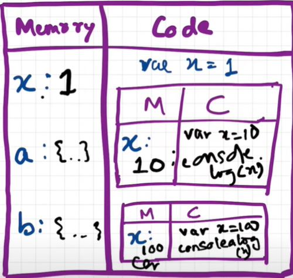

# Episode 4 : Functions and Variable Environments

```js
var x = 1;
a();
b(); 

// ✅ Function calls before definition work due to **hoisting**.
// ✅ Function declarations are **fully hoisted**, meaning they can be called before their definition.

console.log(x); // ✅ Output: 1
// Explanation: The global `x` is still 1 because function `a()` and `b()` had their own local `x` due to function scope.

function a() {
  var x = 10; // ✅ Local scope (`x` is limited to function `a`)
  console.log(x); // ✅ Output: 10
  // Explanation: This `x` is local to function `a()` and does not affect the global `x`.
}

function b() {
  var x = 100; // ✅ Local scope (`x` is limited to function `b`)
  console.log(x); // ✅ Output: 100
  // Explanation: This `x` is local to function `b()` and does not affect the global `x`.
}

```

Outputs:

> 10

> 100

> 1


**Output Explanation**

When the code runs, JavaScript first hoists **function declarations (a and b) and the variable x**, initializing x as undefined. The global x(global scoped x) is then assigned 1. Calling a() creates a new execution context where a local x = 10 is declared, so console.log(x) inside a() prints 10. Similarly, calling b() creates another execution context with x = 100, so console.log(x) inside b() prints 100. Since both functions use their own local x, the global x remains unchanged. Finally, console.log(x) outside the functions prints the global x, which is still 1. Hence, the output is: 10, 100, 1.

## Code Flow in terms of Execution Context

**Global Execution Context (GEC) Creation**

The GEC is created and pushed into the Call Stack.
Phase 1 (Memory Creation Phase):
The variable x is initialized with undefined.
Functions a and b are stored with their full function definitions.
Phase 2 (Code Execution Phase):
x is assigned the value 1.
Functions a and b are invoked.
Call Stack: [GEC]

**Function Execution Context for a()**
When a() is called, a new execution context is created and pushed onto the Call Stack.
Call Stack: [GEC, a()]
Phase 1 (Memory Creation):
A new local variable x (separate from global x) is initialized with undefined.
Phase 2 (Code Execution):
Local x is assigned 10.
console.log(x) prints 10.
Execution is completed, so a's execution context is removed.
Call Stack: [GEC]

**Function Execution Context for b()**
When b() is called, a new execution context is created and pushed onto the Call Stack.
Call Stack: [GEC, b()]
Phase 1 (Memory Creation):
A new local variable x is initialized with undefined.
Phase 2 (Code Execution):
Local x is assigned 100.
console.log(x) prints 100.
Execution is completed, so b's execution context is removed.
Call Stack: [GEC]

**Final console.log(x) Execution**
After both function calls, console.log(x) runs in the Global Execution Context, printing 1 (global x).
Call Stack: [GEC] → (empty after execution)

* reference:



<hr>

Watch Live On Youtube below: 

<!-- https://www.youtube.com/watch?v=gSDncyuGw0s -->
