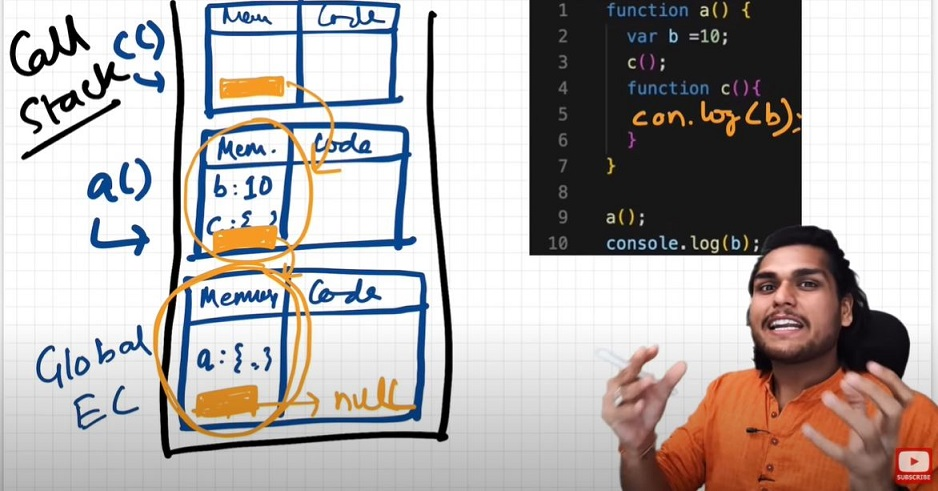
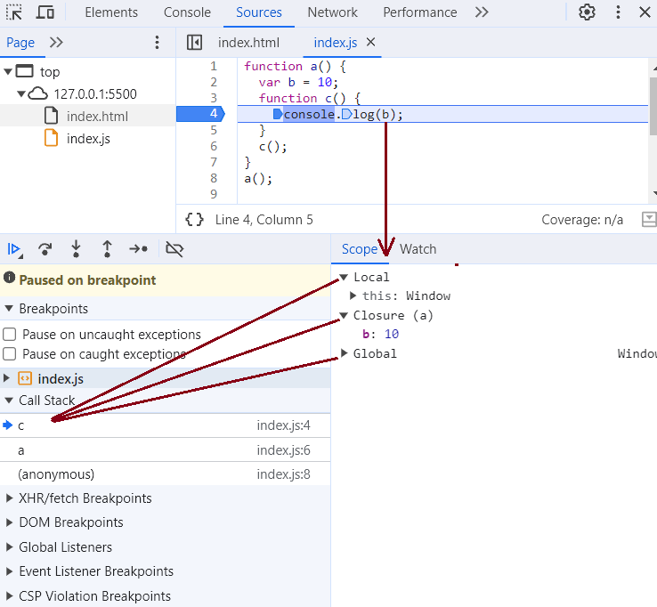

# Episode 7 : The Scope Chain, Scope & Lexical Environment

* **Scope** in JavaScript is directly related to the **Lexical Environment**. Scope refers to the current context of the code, which determines the accessibility of variables.

* Let's observe the below examples:
```js
// CASE 1
function a() {
    console.log(b); // 10
    // Instead of printing undefined, it prints 10. This means the function 'a' 
    // can access the variable 'b' outside its own scope.
}
var b = 10;
a();

// In this case, JavaScript first tries to find 'b' inside the local function scope of 'a'. 
// Since it is not found there, JavaScript looks in its parent scope (the global scope) 
// and finds 'b' with the value 10.
```

```js
// CASE 2
function a() {
    c();
    function c() {
        console.log(b); // 10
    }
}
var b = 10;
a();

// In this case, JavaScript first tries to find 'b' inside the local scope of function 'c', 
// but it is not found there. Then, it looks in 'c's parent scope, which is function 'a', 
// but 'b' is not found there either. Finally, JavaScript looks in the global scope, 
// finds 'b' with the value 10, and prints it.
```

```js
// CASE 3
function a() {
    c();
    function c() {
        var b = 100;
        console.log(b); // 100
    }
}
var b = 10;
a();

// In this case, JavaScript first looks for 'b' inside the local scope of function 'c' 
// and finds it there. Since 'b' is declared with 'var' inside 'c', it is limited to 
// 'c's scope and does not affect the global variable 'b'. Therefore, 100 is printed.
```

```js
// CASE 4
function a() {
    var b = 10; // 'b' is declared inside function 'a' and is only accessible within 'a'.
    c();
    function c() {
        console.log(b); // 10 (JavaScript looks for 'b' inside 'c', doesn't find it, so it checks 'a' and finds it there.)
    }
}
a();
console.log(b); // Error: b is not defined (because 'b' is scoped to function 'a' and not available globally).
```

```
To summarize the 4th case in terms of execution context, place a breakpoint inside function c(). At this point:

Call Stack: [GEC, a(), c()]
Memory allocation in each execution context:
c() → [[Lexical environment pointer → a()]]
a() → { b: 10, c: function c(), [Lexical environment pointer → GEC] }
GEC → { a: function a(), [Lexical environment pointer → null] }

```

   

* **Scope**: The environment where a variable is accessible.

* **Lexical Environment**: A combination of local memory and the Lexical Environment of its parent (also known as the surrounding environment).

* **Lexical Scope**: The ability of a function to access variables from its parent scope.

* Whenever an Execution Context is created, a Lexical Environment (LE) is also created. This environment is stored in memory and referenced within the Execution Context.

 

The orange mark represents a reference pointing to the Lexical Environment of its parent.


**Scope Chain**

* A mechanism JavaScript uses to resolve variable references.

* If JavaScript does not find a variable in the current scope, it searches in its parent scope (Lexical Scope).

* If the variable is not found there, the search continues up the chain until it reaches the global scope.

* This lookup process is called the Scope Chain.

 

In the diagram, the sequence local -> closure -> global forms the Scope Chain. Here, JavaScript is searching for the variable b and finds it in the closure (function a's scope).

* ```js
function a() {
    function c() {
        // Function c is declared inside function a and has access to its scope.
    }
    c(); // Function c is called inside function a. It has lexical access to a's scope.
} 
// Function a is declared in the global execution context and has access to global variables.

  ```

* Lexical (or Static) Scope refers to the accessibility of variables, functions, and objects based on their physical location in the source code.

```js

    Global {
        Outer {
            Inner
        }
    }

  //  Global → Outer → Inner  
  // "Inner is enclosed within the lexical scope of Outer."

```


* **Note** - An inner function can access variables from its outer functions, even if it is deeply nested. However, an outer function cannot access variables declared inside an inner function.


<hr>

Watch Live On Youtube below:

<a href="https://www.youtube.com/watch?v=uH-tVP8MUs8&ab_channel=AkshaySaini" target="_blank"></a>