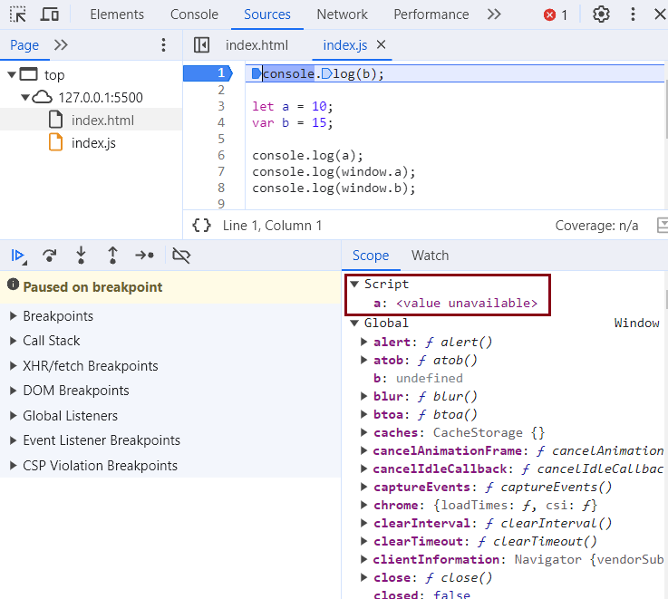

# Episode 8 : let & const in JS, Temporal Dead Zone

* **let** & **const** declarations are hoisted, but they behave differently from var declarations.

```js
    console.log(a); // ReferenceError: Cannot access 'a' before initialization
    console.log(b); // Prints undefined as expected due to var hoisting.
    let a = 10;
    var b = 15;

    console.log(a); // 10   
    console.log(window.a); // undefined
    console.log(window.b); // 15
```

It may seem like **let** isn't hoisted, **but it actually is**.

In the above example, **var b** is hoisted in the global scope with a value of undefined, whereas **let a** is hoisted in a separate memory space called the Script scope with a value of <value unavailable>.

Within this scope, the value of a won’t be available until it is initialized.
The time between when let a is hoisted and when a is initialized is called the Temporal Dead Zone (TDZ).

If we try to access the let variable a within this period, we get a ReferenceError.
The same rule applies to const variables as well.



**Temporal Dead Zone** : The period between when a let variable is hoisted and when it is initialized.Any line of code before **let a = 10;** is within the TDZ for a.Since a is not attached to the global object, it is not accessible via window  or this.
window.b or this.b → 15 (since var b is hoisted and attached to the global scope).
window.a or this.a → undefined (because let does not create a property on the global object).

ReferenceError:Occurs when trying to access a variable in the TDZ.
Example: console.log(a); // ReferenceError: Cannot access 'a' before initialization

**Hoisting Behavior:**

var declarations are hoisted but initialized with undefined.
let and const declarations are hoisted but remain uninitialized in the TDZ.

**SyntaxError vs. ReferenceError:**

ReferenceError: Thrown when accessing a variable in the TDZ.
SyntaxError: Prevents execution entirely due to invalid syntax.

```js
      let a = 10;
      let a = 100;  
      // ❌ SyntaxError: Identifier 'a' has already been declared
      // 'let' does not allow redeclaration in the same scope.
-----------------------------------------------------------------
      let a = 10;
      var a = 100;  
      // ❌ SyntaxError: Identifier 'a' has already been declared
      // Even though 'var' is global-scoped and 'let' is script-scoped, 
      // both exist in the same scope at the script level, causing a conflict.
 ```

**Let** is a stricter version of **var**. Now, **const** is even more stricter than **let**.
```js
   let a;  
   a = 10;  
   console.log(a); // ✅ 10. Declaration and assignment are on different lines, which is allowed for 'let'.

------------------

   const b;  
   b = 10;  
   console.log(b);  
   // ❌ SyntaxError: Missing initializer in 'const' declaration.  
   // 'const' must be initialized at the time of declaration.  
   // Correct way: const b = 10;

------------------

   const b = 100;  
   b = 1000;  
   // ❌ TypeError: Assignment to constant variable.
   // Once a 'const' variable is assigned, it cannot be reassigned.

```

**Types of Errors in JavaScript**

ReferenceError: Occurs when trying to access a variable that is not defined or is in the Temporal Dead Zone.
Example 1:
console.log(x); // ❌ Uncaught ReferenceError: x is not defined
Meaning: The variable x was never declared within the program’s scope.
Example 2:
console.log(a); // ❌ Uncaught ReferenceError: Cannot access 'a' before initialization  
let a = 10;
Meaning: The variable a is declared using let or const, but it is being accessed before its initialization. This happens due to the Temporal Dead Zone (TDZ).

SyntaxError: Occurs when there is incorrect syntax that prevents the script from executing.
Example 1:
let a = 10;
let a = 20; // ❌ Uncaught SyntaxError: Identifier 'a' has already been declared.
Meaning: The variable a is declared again using let in the same scope, which is not allowed.
Example 2:
const b; // ❌ Uncaught SyntaxError: Missing initializer in const declaration  
Meaning: const must be initialized at the time of declaration.

TypeError: Occurs when a value is used in an unexpected way, such as modifying an immutable value.
Example:
const b = 100;
b = 200; // ❌ Uncaught TypeError: Assignment to constant variable  
Meaning: b is declared as const, so its value cannot be reassigned after initialization.

ReferenceError → Variable is either not defined or in the Temporal Dead Zone.
SyntaxError → Code contains an invalid syntax, preventing execution.
TypeError → A value is being used incorrectly (e.g., modifying a const variable).

### SOME GOOD PRACTICES:

* Prefer using const whenever possible.
* If reassignment is needed, use let and avoid var.
* Always declare and initialize let variables at the top to minimize errors and reduce the Temporal Dead Zone (TDZ) to zero.

**Note**
If a variable is not present in the window object, accessing it using window.<VarName> will return undefined.This is how JavaScript works in the browser.

**Are let and const variables hoisted?**

Like var declarations, let and const declarations are also hoisted. Although it may seem like they are not hoisted, internally, they are. The key difference is that var declarations are hoisted in the global scope, whereas let and const declarations are hoisted in the script scope, which is a temporary JavaScript object scope.

With var, we can access the variable before it is initialized, but with let and const, we cannot access the variable before initialization. This is because the period from when a let or const variable is hoisted until it is initialized is called the Temporal Dead Zone (TDZ). Any attempt to access let or const variables within the TDZ results in a ReferenceError.

<hr>

Watch Live On Youtube below:

<a href="https://www.youtube.com/watch?v=BNC6slYCj50&ab_channel=AkshaySaini" target="_blank"></a>