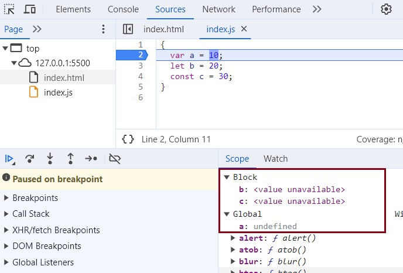

# Episode 9 : Block Scope & Shadowing in JS

// What is a **Block**?

// A Block (also known as a *compound statement*) is used to group multiple JavaScript statements together.
// Blocks are enclosed within `{ ... }`.

// Why do we need to group statements in a block?

// JavaScript often expects a **single** statement in certain places, like after an `if` condition.
// Using a block allows us to provide **multiple** statements where only one is expected.

// Example 1: Without a block (Single statement)
if (true) console.log("JS expects a single statement after the if condition");

// Example 2: With a block (Multiple statements treated as one)
if (true) {
    var x = 20;
    console.log("JS allows multiple statements by grouping them in a block");
}




```js
    
{
    var a = 10;
    let b = 20;
    const c = 30;
}

console.log(a); // 10 (var is accessible outside the block)
console.log(b); // ReferenceError: b is not defined (let is block-scoped)
console.log(c); // ReferenceError: c is not defined (const is block-scoped)

```

✅ var is function-scoped and leaks out of the block.
✅ let and const are block-scoped, meaning they only exist inside the block where they are declared.
✅ let and const are hoisted but remain in the Temporal Dead Zone (TDZ) until initialized.

# Why is var Function-Scoped?

In JavaScript, scope determines where a variable can be accessed. var is function-scoped, meaning a variable declared with var is only accessible within the function in which it is declared.

**How Does var Work?**

When you declare a variable using var:
If it's inside a function, it is scoped to that function (i.e., it cannot be accessed outside).
If it's outside a function, it becomes globally scoped (i.e., accessible anywhere).

function testVar() {
    var x = 10; // Scoped to this function
    console.log(x); // ✅ 10 (Accessible inside the function)
}
testVar();
console.log(x); // ❌ ReferenceError: x is not defined (x is not available outside the function)
// Here, x is declared inside testVar(), so it only exists within that function.


# var is NOT Block-Scoped

Unlike let and const, var ignores block {} boundaries and only respects function boundaries.

Example: var Leaks Outside a Block

if (true) {
    var y = 20;
}
console.log(y); // ✅ 20 (Even though declared inside if-block, it's accessible outside).Since var is not block-scoped, y is still available outside the {}.

**var in a Loop**

for (var i = 0; i < 3; i++) {
    console.log(i); // ✅ 0, 1, 2
}
console.log(i); // ✅ 3 (i is still accessible outside the loop)

# What Does Block Scope Mean?

A block in JavaScript is any code enclosed within {}.
Variables declared with let or const inside a block {} cannot be accessed outside of that block.

{
    let a = 10;
    const b = 20;
    console.log(a, b); // ✅ 10 20 (Accessible inside the block)
}
console.log(a, b); // ❌ ReferenceError: a is not defined

// a and b only exist inside the block {} and cannot be accessed outside.

# Why Are let and const Block-Scoped?

The reason let and const are block-scoped is to prevent unintended variable leaks.
With var, variables declared inside a block leak outside, which can cause unpredictable behavior.


* Block Scope and its accessibility example

```js
    {
        var a = 10;
        let b = 20;
        const c = 30;
    }
    console.log(a); // 10
    console.log(b); // Uncaught ReferenceError: b is not defined
```

**Reason for the error:**

* Inside a block scope, let and const are hoisted but set to <value not available> until they are initialized. Once initialized, they can be accessed within the block.

* In contrast, var is stored in the global scope.

* Therefore, we say that let and const are block-scoped. They are stored in a separate memory space reserved for the block and cannot be accessed outside of it. However, var can be accessed anywhere since it belongs to the global scope.

**Shadowing**

* ```js
   var a = 100; // 'a' is declared in the global scope

{
    var a = 10; // This redeclares and modifies the global 'a' instead of creating a new variable within the block
    let b = 20; // 'b' is block-scoped and only accessible inside this block
    const c = 30; // 'c' is block-scoped and only accessible inside this block

    console.log(a); // 10 → The global 'a' has been updated to 10
    console.log(b); // 20 → 'b' is accessible within the block
    console.log(c); // 30 → 'c' is accessible within the block
}

console.log(a); // 10 → Since 'var' does not have block scope, the global 'a' was modified inside the block

// In the console:
// - 'b' and 'c' exist only in the block scope and are inaccessible outside.
// - 'a' was initially in the global scope (a = 100).
// - When 'a = 10' is executed inside the block, it does NOT create a new 'a' in block scope.
// - Instead, it replaces the value of global 'a' from 100 to 10.

```

* So, if there is a variable with the same name outside the block, the variable inside the block shadows the outside variable. This happens only with var.

* Let's observe the behavior of let and const and understand the reason behind it.

```js
let b = 100; // 'b' is declared in the script/global scope

{
    var a = 10;  // 'a' is declared with var, so it remains in the global scope
    let b = 20;  // This 'b' is block-scoped and does not affect the outer 'b'
    const c = 30; // 'c' is also block-scoped

    console.log(b); // 20 → The inner 'b' (block-scoped) is accessed inside the block
}

console.log(b); // 100 → The outer 'b' remains unchanged, as 'let' has block scope

// Explanation:
// - The 'b' inside the block (b = 20) is stored in a separate memory space (block scope).
// - The outer 'b' (b = 100) exists in the script/global scope and remains unaffected.
// - The same is true for 'const'—it is also block-scoped and doesn't affect the outer scope.
// - 'var a' is NOT block-scoped, so it exists in the global scope, even though it's declared inside the block.

```


```js

    const c = 100; // 'c' is declared in the global scope
    function x() {
        const c = 10; // This 'c' is function-scoped (local scoped 'c')
        console.log(c); // 10 → The function accesses its own 'c', not the global one
    }
    x(); // Calls the function 'x', printing 10
    console.log(c); // 100 → The global script scoped 'c' remains unchanged, as functions create their own scope.

```

**Illegal Shadowing**

```js

let a = 20; // let a = 20; is declared in the global  scope.

{
    var a = 30; //  var a = 30; attempts to redeclare a, but var is function-scoped, meaning it also exists in the global scope.
}

// This creates ambiguity because:
// - 'let a' exists in the global (script) scope.
// - 'var a' also tries to exist in the global scope (since 'var' is not block-scoped).
// - JavaScript does not allow var to redeclare an already declared let in the same scope, leading to a SyntaxError.

console.log(a); // ❌ SyntaxError: Identifier 'a' has already been declared

// 🔴 This is called **illegal shadowing** because:
// - A 'var' variable cannot redeclare a 'let' or 'const' variable in the same scope.
// - This results in a **SyntaxError** before execution.

```

* We cannot shadow a let with var, but it is valid to shadow a let with another let. However, we can shadow a var with let.

* All scope rules that apply to regular functions also apply to arrow functions.

* Since var is function-scoped, there is no issue with the code below.

```js
       let a = 20; // Global scope: 'a' is declared in the script/global scope

       function x() {
           var a = 20; // Function scope: This 'a' is local to 'x' and does not affect the global 'a'
           // ✅ Valid shadowing: The function-scoped 'a' temporarily hides the global 'a' within 'x'
        }

```

```js
        var a = 20; // Global scope: 'a' is declared in the global execution context
        
        {
          let a = 30; // Block scope: This 'a' exists only within this block
          console.log(a); // 30 → Block-scoped 'a' is accessed here
        }

// At this point, the block-scoped 'a' is no longer accessible (garbage collected)
console.log(a); // 20 → Global 'a' is accessed since the block-scoped 'a' is out of scope

```


Note – Each block has its own lexical scope and follows the scope chain hierarchy.

<hr>

Watch Live On Youtube below:

<a href="https://www.youtube.com/watch?v=lW_erSjyMeM&ab_channel=AkshaySaini" target="_blank"></a>